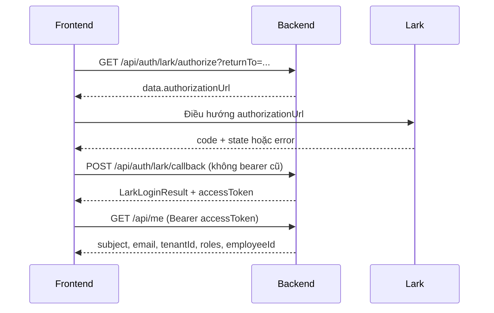
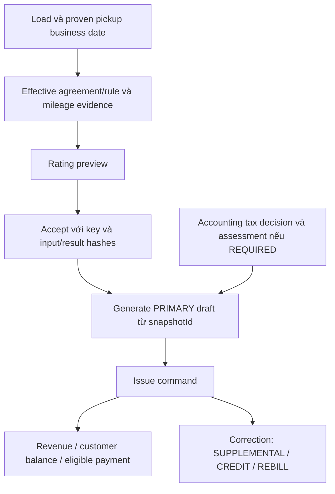

# Context bàn giao Backend → Frontend — LogisticsX / Logicstic

Ngày đối chiếu: **2026-10-07, Asia/Ho_Chi_Minh**. Backend repo:
`logictics_api`; client đã đọc: `logictics-app` (React, TypeScript, Refine,
Axios, TanStack Query, Ant Design). Tài liệu này dùng để đối chiếu types,
requests, quyền và flow nghiệp vụ; phiên này chỉ tạo tài liệu/contract artifacts.

## 1. Đọc gì trước và dùng bản backend nào

Đọc theo thứ tự:

1. Tài liệu này: quy tắc nghiệp vụ và cách nối UI với API.
2. [Danh mục API](frontend/api-operation-index.md): **176 operations / 140 paths**,
   method, URL, query/body, response schema và response mode từng operation.
3. [OpenAPI 3.1](frontend/openapi-backend-remediation.json): **291 schemas**, đầy đủ
   request/response fields, required, formats, constraints và nested DTOs.
4. [Payload mẫu](frontend/request-examples.json) và
   [các ngoại lệ contract](frontend/contract-notes.json).
5. [Nguồn snapshot](frontend/openapi-provenance.json),
   [backend verification](verification/backend-remediation-status.md) và
   [release gates](verification/remediation-release-gates.md).

Contract được xuất từ đúng **JAR đã kiểm chứng**, khớp source SHA-256
`b69beb469fda434309c8b3f8f9d7135142872c9c563ffbc890d08e191d3b4795`, schema V38.
Source đang dirty trên HEAD `0c795f8`; hash này xác định bản source, không phải
chứng nhận một clean release commit. Canonical OpenAPI SHA-256:
`2d10d31b8c7a013fa10aca92b5cf3411cadf8dcd5a1ca88f540201b3771e7774`.

**Container đang chạy tại `:8080` vẫn là bản cũ V35, 138 paths, còn anonymous
Payment 200.** Không lấy contract từ container đó để phủ định payload mới.
Frontend integration phải chạy trên staging/local có artifact khớp contract này.
ADMIN có thể kiểm tra `GET /api/internal/build`; health UP chỉ xác nhận liveness.
Frontend không cần gọi endpoint ADMIN này trong bootstrap của mọi người dùng.

Backend đã qua hai full runs sạch/populated clone, mỗi run **563 Java tests,
214 PostgreSQL tests, zero failures/errors/skips**, 26 Python tests và local JAR
checks. Đây là bằng chứng backend; chưa phải frontend E2E hoặc production rollout.

## 2. Quy ước transport, URL và response

### URL, headers và CORS

Tất cả URL bên dưới đã gồm prefix `/api`. Với `apiClient` hiện tại, dùng
`apiBaseUrl` là origin/base gateway phù hợp và operation path là `/api/...`.
Ví dụ origin `http://localhost:8080` + `/api/me` tạo URL `/api/me`; kiểm tra Network
để tránh `/api/api/me`. Runtime config được dùng trong `App.tsx`; legacy
`VITE_API_BASE_URL`/các default `/auth/*` không tự trở thành API backend.
Nếu frontend vẫn lấy Lark URL từ legacy env, cấu hình `VITE_LARK_LOGIN_URL`
trỏ đúng `/api/auth/lark/login`; default `${apiBaseUrl}/auth/lark/login` trong
legacy helper không tự thêm `/api` khi base đã chuyển sang origin.

JSON commands dùng `Content-Type: application/json`, `Accept: application/json`.
Business request dùng `Authorization: Bearer <access token>`. Gửi `X-Request-Id`
để đối chiếu lỗi. CORS hiện cho phép các header `Authorization`, `Content-Type`,
`X-Request-Id`, explicit origin allowlist và không dùng credentials cookie.
Không tự thêm `X-Tenant-Key` hoặc `X-Correlation-Id` vào browser requests.
Preflight thành công không cấp quyền cho actual request.

### Envelope của phần lớn API

Wire response:

```json
{
  "success": true,
  "code": "OK",
  "message": "Request completed successfully",
  "data": {},
  "errors": [],
  "meta": {
    "timestamp": "2026-10-07T00:00:00Z",
    "path": "/api/me",
    "requestId": "request-id-do-client-gui"
  }
}
```

Client `src/providers/api/apiClient.ts` **đã unwrap `envelope.data`** ở interceptor.
Với ENVELOPE endpoint, `response.data` ở feature là business DTO; không đọc thêm
`response.data.data`. Không đổi adapter chung chỉ vì một endpoint có response khác.

### Các endpoint trả RAW JSON hoặc binary

Payroll configuration/run/payment/callback, Payslip metadata/list và health trả
DTO, mảng hoặc Spring Page trực tiếp. Bảng API đánh dấu RAW JSON từng operation.
Client mặc định yêu cầu envelope, vì vậy các feature này cần response mode rõ:

```ts
// apiClient hiện có; ví dụ kết nối, không phải code đã áp dụng vào frontend.
const response = await apiClient.instance.get(`/api/payroll/runs/${runId}`, {
  logistics: { responseMode: "raw" },
});
const run = response.data; // PayrollRunView trực tiếp
```

Error interceptor vẫn phải đọc normalized error envelope. Không bật raw cho tất
cả business APIs hoặc bỏ kiểm tra response schema. `GET /api/payslips/{id}/pdf`
trả `application/pdf`; dùng download/blob, không unwrap/parse JSON. Lark login
trả redirect 302; `/authorize` là lựa chọn JSON cho SPA.

### Pagination có nhiều dạng

CORE/customer/payment/messages dùng envelope chứa:

```ts
type PagedResponse<T> = {
  items: T[];
  totalItems: number;
  totalPages: number;
  currentPage: number; // 1-based
  pageSize: number;
};
```

Mapping Refine: `data = items`, `total = totalItems`; `page`, `pageSize`,
`orderBy`, `descending` và filter fields phải theo từng endpoint. Payments
filter `status`, `invoiceId`; không có query `search` chung cho Payment.
Messages mặc định pageSize 50; conversations mặc định 20.

Settlement list trả `ApiResponse<List<DriverSettlementView>>`, không phải page.
`GET /api/payroll/reconciliation-cases` trả **RAW Spring Page**, query `page`
**0-based**, `size` mặc định 25, response `content`, `totalElements`, `number`,
`size`. Dùng adapter riêng, không ép mọi list vào PagedResponse.

### Data types và field ownership

- UUID/IDs là string; `number` của Load/Trip/Invoice là số hiển thị, không phải ID.
- Request/response CORE và Payment dùng nhiều **field phẳng**:
  `amountAmount`, `amountCurrency`, `billingAddressLine1`, `deliveryCostAmount`,
  `originLocationLatitude`… Không gửi object `amount`, `billingAddress`, `deliveryCost`
  nếu schema yêu cầu field phẳng. Tách wire DTO khỏi view model nếu UI muốn nested.
- Date-only là `YYYY-MM-DD`; instant là ISO date-time có offset/Z. Không chuyển
  LocalDate qua `new Date(...).toISOString()` để suy ngày nghiệp vụ.
- Dùng decimal handling đã có cho tính/display tiền. Số dư/thuế/lương cuối cùng
  do backend quyết định. Payment lưu tối đa 2 chữ số thập phân; không làm tròn
  ngầm input để vượt validation. Các domain tiền khác có currency/rounding policy
  riêng, không ép tất cả về 2 decimals.
- Không spread response DTO thành update body: response có fields server sở hữu,
  fields read-only, và không phải endpoint nào cũng có `expectedVersion`.
- `status`/`type` CORE còn là string trong schema. Các enum/comment đường dẫn Java
  trong client cũ cần đối chiếu lại; không tự lower-case/upper-case mọi request
  hoặc tự đặt một state machine cho mọi entity.

## 3. Authentication, identity và tenant

Flow Lark hiện có:



- `/authorize` GET và `/login` GET public. `/callback` là **POST JSON** public ở
  HTTP authentication nhưng vẫn kiểm tra state/provider/tenant. Client hiện đã
  dùng `logistics: { authentication: "none" }` khi gọi callback; giữ cách này.
- Callback thành công cần code/state thật. Provider error callback có `error`
  được xử lý riêng, không ép phải có code. `returnTo` là routing intent, không
  phải tenant selector.
- `LarkLoginResult`: `accessToken`, `tokenType`, `expiresIn`, `subject`, `name`,
  `email`, `roles`, `tenantId`, `employeeId`, `returnTo`.
- Backend dùng **tenant cấu hình của login**, lookup employee/role trong tenant
  đó và ký cùng tenant. Bound/principal tenant khác trả 403 trước provider call.
  Tenant inactive trả 403; persistence/registry unavailable có thể trả 503.
- Frontend không giữ signing key. `LARK_JWT_SECRET`, provider/client secrets thuộc
  backend/identity deployment, không đưa vào `VITE_*` hay runtime public config.

`GET /api/me` có envelope; response data chính xác:

```ts
type CurrentUserResponse = {
  subject: string;
  email: string | null;
  tenantId: string;
  roles: string[]; // không có ROLE_ prefix; không tự alias role
  employeeId: string | null;
};
```

`subject` không phải `employeeId`. `employeeId` mapping từ tenant DB, có thể null
dù token có claimed employee ID. Client hiện đã có `createCurrentUserLoader` và
đã wire trong `App.tsx`; giữ kiểm tra subject/tenant/roles cùng session, không
thay thế bằng arbitrary employee selector.

**Gate về OIDC:** client có runtime OIDC issuer/JWKS/audience và session manager.
Backend SecurityConfig hiện xác thực bearer qua Lark internal-token filter; chưa
có resource-server/JWKS verifier cho OIDC bearer trong source đã đối chiếu.
Test `/api/me` với normalized OIDC principal không chứng minh OIDC token qua HTTP
được verifier này chấp nhận. Chọn flow/token adapter khớp deployment thật và kiểm
tra real token → `/api/me` trước integration. Không giải quyết bằng chia sẻ HMAC
secret cho browser, bỏ signature validation hay fallback anonymous.

Backend này không cung cấp password-login, generic refresh/logout/tenant-switch
API trong snapshot. Refresh phải theo identity provider/session contract đang
triển khai; Lark token hết hạn có thể cần login lại. Không suy `/auth/refresh`,
`/api/auth/me` hay `/auth/tenant/switch` từ legacy env defaults.

Tenant không do body/query/header frontend lựa chọn. Đổi tenant cần phiên/token
hợp lệ cho tenant mới. Xóa cache tenant/user cũ khi đổi phiên; cache keys phải có
tenant và thêm subject/employee khi dữ liệu theo người. Không đồng nhất opaque
legacy `payments.tenant_id` UUID với `me.tenantId`.

## 4. Role/action matrix cho menu và buttons

Matrix này từ matcher hiện tại, có precedence; object/domain checks vẫn chạy
sau role check. ADMIN cũng phải đáp ứng employee/membership khi nghiệp vụ yêu cầu.

| Operation/group | Roles |
|---|---|
| GET `/api/me`; messages | Authenticated; messaging cần mapped employee |
| Roles, `/api/internal/**` | ADMIN |
| Payment, Invoice, Rating/rules/contracts/snapshots | ADMIN, ACCOUNTANT |
| CORE Loads/Trucks/Customers | ADMIN, ACCOUNTANT, DISPATCHER |
| CORE Trips/Trip stops/Employees/Drivers/Inspections | ADMIN, DISPATCHER |
| Documents | ADMIN, ACCOUNTANT, DISPATCHER |
| Pickup business date | ADMIN, ACCOUNTANT, DISPATCHER + mapped employee |
| Reports (`/api/reports/**`), customer balance, load financial summary/costs | ADMIN, ACCOUNTANT, PAYROLL, PAYROLL_MANAGER |
| Settlement, pay period, driver-pay policy, payroll | ADMIN, ACCOUNTANT, PAYROLL, PAYROLL_MANAGER |
| Expense/accessorial approve | ADMIN, ACCOUNTANT |
| Accessorial read/create/detention calculation | ADMIN, ACCOUNTANT, DISPATCHER |
| Fleet policy publish POST | ADMIN |
| Fleet status/mileage POST | ADMIN, DISPATCHER |
| Other `/api/fleet/**` | ADMIN, ACCOUNTANT, DISPATCHER |
| Optimization policy POST; qualified-input capture POST | ADMIN |
| Optimization forecast capture POST | ADMIN, ACCOUNTANT |
| Optimization qualified-input GET | ADMIN, ACCOUNTANT, DISPATCHER |
| Other optimization/run/accept | ADMIN, DISPATCHER |
| Tenant chat create | ADMIN + mapped employee |
| Private chat read/send | Mapped employee có membership; ADMIN không bypass |
| Driver own payslips | Authenticated mapped employee; xem người khác cần privileged payroll roles |

`/api/reports/fleet/**` dùng report roles, khác `/api/fleet/**`. Financial summary
của Load và rating routes có matcher cụ thể trước general Load matcher; quyền
CRUD Load không cấp quyền rating/financial summary. Các route chưa có matrix
riêng fallback authenticated; không tự cấp thêm domain quyền dựa vào fallback.

## 5. Error handling và retry

```json
{
  "success": false,
  "code": "VALIDATION_FAILED",
  "message": "Thông báo từ backend",
  "data": null,
  "errors": [{"field": "taxDecision.reason", "code": "NotBlank", "message": "must not be blank"}],
  "meta": {"timestamp": "2026-10-07T00:00:00Z", "path": "/api/invoices/billing/primary", "requestId": "request-id"}
}
```

| HTTP / code | Hành vi frontend |
|---|---|
| 400 VALIDATION_FAILED | Map `errors[].field` (kể cả nested/index) vào form; giữ input |
| 400 MALFORMED_REQUEST | Sai kiểu/JSON hoặc missing primitive; không retry cùng body |
| 401 UNAUTHORIZED | Auth required/expired/malformed; refresh đúng provider tối đa giới hạn hiện có hoặc login lại |
| 403 FORBIDDEN / IDENTITY_TENANT_MISMATCH / INVALID_TENANT_CONTEXT | Denied; không refresh/logout loop; mismatch phiên cần xác minh lại identity |
| 404 | Không có object trong routed tenant; không thử selector tenant khác |
| 409 CONCURRENT_MODIFICATION_CONFLICT | Giữ draft, reread server, cho người dùng so sánh/chọn; không overwrite tự động |
| 409 PAYMENT_IDEMPOTENCY_CONFLICT | Key đã dùng cho ý định khác; không tự đổi key để né conflict |
| 409 PAYMENT_*_STATE_CONFLICT / PAYMENT_INVOICE_NOT_COLLECTIBLE | Reread state; hiển thị vì sao action không hợp lệ |
| 409 PAYMENT_DELETE_FORBIDDEN / PAYMENT_FINANCIAL_FIELDS_IMMUTABLE | Luồng/UI sai contract; chuyển sang metadata/cancel phù hợp |
| 422 PAYMENT_EXCEEDS_INVOICE_BALANCE / CURRENCY_MISMATCH | Lỗi domain Payment; reload invoice/payments, giữ draft |
| 400 CURRENCY_MISMATCH ở reporting | Không cộng tiền khác currency; không thay kết quả lỗi bằng 0 |
| 503 TENANT_UNAVAILABLE / LARK_DISABLED | Service unavailable; trạng thái UI có lý do, không giả login thành công |

Không phải mọi 422 đều là field validation và không phải mọi 409 đều là version
conflict. Đọc cả HTTP status và `code`. `errors[].code` có thể là constraint
validation, không phải top-level domain code. `meta.requestId` có thể null nếu
caller không gửi header; không invent top-level `fieldErrors` hay request ID.

Client hiện đã có phân biệt 401/403, single refresh coordination và error adapter.
Giữ semantics đó. Retry financial POST sau timeout/401 phải giữ nguyên frozen
body/key của user intent. Request ID có thể đổi theo attempt; nó không thay thế
`idempotencyKey`. Không tự retry create/send/cancel theo generic CRUD policy nếu
operation không có command identity bảo đảm replay.

## 6. CORE CRUD: Load / Trip / Truck và stale form

| API | Create body | Update body | Response |
|---|---|---|---|
| POST `/api/loads`; PUT `/api/loads/{id}` | CreateLoadRequest | UpdateLoadRequest | LoadView có `version` |
| POST `/api/trips`; PUT `/api/trips/{id}` | CreateTripRequest | UpdateTripRequest | TripView có `version` |
| POST `/api/trucks`; PUT `/api/trucks/{id}` | CreateTruckRequest | UpdateTruckRequest | TruckView có `version` |

PUT yêu cầu **expectedVersion >= 0** cộng các fields required của update DTO.
Đây không phải PATCH chỉ gồm changed fields. Create không cần expectedVersion.
Không gửi `version` thay cho expectedVersion hoặc set version entity từ UI.

```json
{
  "expectedVersion": 2,
  "name": "Trip mẫu chỉnh sửa",
  "totalDistance": 100,
  "status": "draft",
  "truckId": "00000005-1111-4111-8111-111111111111"
}
```

Flow: GET detail → lưu bản DTO/version khi mở form → PUT với version đó → nhận
DTO/version do server flush → invalidate detail/list và dependent views. Writer
khác hoặc command optimization có thể làm version đổi trong lúc form đang mở.
409 giữ nguyên draft; reread và cho người dùng giải quyết. Không dùng version mới
để tự submit lại draft cũ. No-op không nên giả định luôn tăng version; dùng version
trong response.

Load payload bắt buộc cả address/location phẳng, customer, flags, source và money
fields theo schema. `isInProximity` hiện required trong create/update DTO; generic
form coi đây là read-only và bỏ payload sẽ thiếu field. Trip create/update hiện
không có field `stops`; không gửi nested stops theo generic form. LoadView không
trả lại mọi optional selector từ CreateLoadRequest: tách mapping hydrate form,
không tự clear relation vì response projection không có field.

### Pickup business date riêng với appointment instant

`requestedPickupDate` là date-time appointment legacy.
`requestedPickupBusinessDate` là LocalDate độc lập dùng rating. Không suy date
này từ appointment/createdAt/timezone hiện tại.

POST `/api/loads/{id}/requested-pickup-business-date` body:

```json
{
  "requestedPickupBusinessDate": "2026-10-07",
  "provenance": {"reasonCode": "CUSTOMER_PICKUP", "reason": "Khách hàng xác nhận ngày lấy hàng", "source": "customer agreement"},
  "expectedChangeId": "00000006-1111-4111-8111-111111111111"
}
```

Lần đầu chưa có audit dùng expectedChangeId null; sau đó lấy
`LoadView.pickupBusinessDateChangeId`. Stale trả 409 `LOAD_PICKUP_DATE_CONFLICT`.
Command này dùng expectedChangeId, khác expectedVersion của generic PUT. Lấy
LoadView/version mới sau command để form cũ không ghi đè. Date null/omitted trong
generic update không ngầm xóa proven business date. Thiếu date làm rating reject
`RATING_PRICING_DATE_REQUIRED`. Xóa Load đã có lịch sử date có thể bị chặn
`LOAD_PICKUP_DATE_HISTORY_PROTECTED`.

## 7. Messaging: identity → conversation → read/send

| Method / API | Input | Success |
|---|---|---|
| GET `/api/messages/conversations` | query employeeId = `/api/me.employeeId`, page/pageSize | PagedResponse<ConversationView> |
| GET `/api/messages/conversations/{id}` | path conversation ID | ConversationView |
| POST `/api/messages/conversations` | `{name?, loadId?, isTenantChat}` | 201 ConversationView |
| GET `/api/messages` | query conversationId, page/pageSize | PagedResponse<MessageView> |
| POST `/api/messages` | `{conversationId, content, senderId?}` | 201 MessageView |
| GET `/api/messages/unread-count` | query employeeId = current employee | numeric count |

Mọi messaging path cần mapped employee. Nếu `employeeId == null`, UI hiển thị
chưa có employee mapping, không mở selector người khác để bypass.
Content nonblank, tối đa 2000 characters. Omit senderId là đường chính; nếu gửi
thì chỉ bằng employee hiện tại, khác trả 403. Response senderId do server quyết định.

Private conversation cần membership cả đọc/detail/gửi; bị remove thì request
mới bị denied. Tenant chat chỉ ADMIN tạo, mapped employees cùng tenant đọc/gửi.
CreateConversationRequest không có participantIds: server tự thêm creator, chưa
có API quản lý/thêm/xóa participants trong bundle. Không dựng group-chat membership
UI với endpoint giả. Chưa có WebSocket/read-receipt/mark-read command trong các
message routes này; chọn cơ chế cập nhật theo khả năng API hiện có.

Sau send: invalidate messages(conversation), conversation detail/list và unread
theo current employee; không optimistic-claim một sender/permission do client chọn.

## 8. Payment: command riêng, không generic financial CRUD

Customer Payment `/api/payments` độc lập PayrollPayment `/api/payroll/...`.
Roles ADMIN/ACCOUNTANT; financial writes cần employee mapping cùng tenant.

| Operation | Body/query | Quy tắc |
|---|---|---|
| GET `/api/payments` | query status, invoiceId, page/pageSize/orderBy/descending | PagedResponse<PaymentView> |
| GET `/api/payments/{id}` | — | PaymentView |
| POST `/api/payments` | CreatePaymentRequest | 201; bắt buộc invoice/key, tạo PENDING |
| PUT `/api/payments/{id}` | chỉ description/referenceNumber | 200; chỉ PENDING |
| POST `/api/payments/{id}/cancel` | **query** reason (1–1000 chars) | 200; PENDING → CANCELLED |
| DELETE `/api/payments/{id}` | — | 409 PAYMENT_DELETE_FORBIDDEN cho authorized actor |

Payload create mẫu:

```json
{
  "status": "PENDING",
  "invoiceId": "00000003-1111-4111-8111-111111111111",
  "amountAmount": 40.00,
  "amountCurrency": "USD",
  "description": "Thanh toán invoice",
  "referenceNumber": "REF-EXAMPLE-001",
  "idempotencyKey": "example-payment-intent-001",
  "billingAddressLine1": "123 Example Street",
  "billingAddressCity": "Example City",
  "billingAddressState": "TX",
  "billingAddressZipCode": "00000",
  "billingAddressCountry": "US"
}
```

- Key nonblank, tối đa 200 chars. Amount > 0, tối đa 16 integer digits/2 decimals;
  supported currency, bằng invoice currency, không implicit FX.
- Required billing address như mẫu; line2 optional. Không gửi recordedAt hoặc
  recordedByUserId: server gán actor/time. Provider IDs optional là metadata,
  không phải lệnh thực hiện Stripe/bank transfer.
- Invoice collectible: ISSUED/SENT/PARTIALLY_PAID; draft/cancelled/paid/credit
  không nhận payment mới. Unknown legacy payment state làm command fail closed.
- PENDING **giữ số dư**, COMPLETED/PAID/SUCCEEDED/SETTLED chiếm số dư;
  CANCELLED/VOID không chiếm. Server serialize invoice balance.
- Same key + cùng normalized input → cùng payment ID, không thêm row/effect,
  HTTP vẫn 201. Input bao gồm meaningful creation metadata/address/provider IDs,
  không chỉ amount/currency/invoice. Same key changed input → 409.

UI tạo **một key cho một ý định**, freeze command trước lần gửi đầu tiên. Double
click/timeout/network retry giữ key/body; không sinh key mới mỗi retry. Nếu chưa
biết request trước đã commit, replay cùng command để lấy kết quả trước khi xử lý
ý định mới. Không clear form/key chỉ vì timeout. Server replay có thể trả state
hiện tại của payment; không tự reset response thành PENDING.

Metadata PUT ví dụ `{"description":"Ghi chú mới"}`: omitted reference giữ nguyên;
explicit `{"description":null}` xóa description. Mọi supplied property khác
(kể cả status/invoice/key/amount/currency/recordedAt) → 409 immutable-fields.
Không gửi toàn bộ PaymentView từ edit form. Terminal metadata edits bị chặn.

Cancel có confirm/reason; retry CANCELLED trả cùng row và giữ audit trước. Thành
công terminal không được cancel; refund/reversal/settlement/provider-completion
ngoài current Payment API. Tắt physical delete và các status select cho generic
payment edit/create. Không hiển thị “đã thu tiền” chỉ vì POST tạo PENDING thành công.

PaymentView là field phẳng: `id`, `status`, `invoiceId`, `invoiceNumber`,
`amountAmount`, `amountCurrency`, `description`, `referenceNumber`, `recordedAt`,
address fields. Nó không có tenantId, input hash, idempotencyKey, version,
recordedByUserId, Stripe IDs hoặc toàn bộ auditable entity fields. Giữ key ở command
state frontend; không suy nó từ response không chứa key.

Sau create/metadata/cancel: invalidate payments list/detail theo invoice, invoice
detail, customer balance, load revenue/financial views liên quan. Paid/open report
đếm **SETTLED** đã được sửa; PENDING reserve nhưng không đếm paid. Ví dụ invoice
100 và SETTLED 40 → report paid 40/open 60. Invoice 100 và PENDING 40 có thể báo
open 100 nhưng chỉ còn 60 để tạo payment. Không dùng report open làm authoritative
available-to-pay; hiện chưa có reservation-balance endpoint riêng trong bundle.

## 9. Rating → accepted snapshot → billing



| Operation | Contract chính |
|---|---|
| POST `/api/rating/contracts`; `/api/rating/rules` | RatingContractRequest / RateRuleRequest; versioned policies |
| POST `/api/rating/contracts/{id}/versions`; `/api/rating/rules/{id}/versions` | body policy, query expectedVersion |
| POST `/api/loads/{id}/rating/contract-mileage` | ContractMileageRequest; component, agreement/version, originalValue/unit, provenance |
| POST `/api/loads/{id}/rating/preview` | RatingPreviewRequest; currency, contextSource, accessorialIds bắt buộc |
| POST `/api/loads/{id}/rating/accept` | RatingAcceptRequest; key, cùng rating request, expectedInputHash/expectedResultHash |
| GET `/api/rating/snapshots/{id}` | AcceptedRatingSnapshot |
| POST `/api/invoices/billing/primary` | GenerateInvoiceRequest: key, snapshotId, taxDecision, lineTaxes |
| GET `/api/invoices/billing/{id}` | BillingInvoice; định danh `invoiceId`, khác InvoiceView.id |
| POST `/api/invoices/billing/{id}/regenerate` | expectedSnapshotId + generation; draft-only |
| POST `/api/invoices/billing/{id}/issue` | `{idempotencyKey}` |
| POST `/api/invoices/billing/{id}/supplemental`, `/credit`, `/rebill` | DTO riêng theo schema, reason/evidence đầy đủ |

Preview trả `inputHash`, `resultHash`, explanation/lines/currency/rounding. Preview
không tạo accepted financial history. Accept gửi nguyên request đã preview và
hash server, không tự tính lại ở frontend. Optional selectors không đồng nghĩa
mọi selector đều required: service resolve authoritative defaults nếu có;
currency/contextSource/accessorialIds vẫn required. Rerating/correction cần
supersedesSnapshotId và lý do khi workflow yêu cầu.

Không lấy `loads.distance`, trip totalDistance hoặc latest arbitrary evidence
thay qualified mileage. Contract-mileage V1 dùng MILE và evidence theo component;
thiếu qualified source → UNAVAILABLE/named error, không fallback guessed distance.

Generate invoice từ **accepted snapshot**, không từ preview/current quote/current
RateRule. TaxDecision REQUIRED/NOT_REQUIRED là explicit Accounting decision có
reasonCode/reason/sourceReference. REQUIRED cần assessment và line allocations;
không tự mặc định tax=0 từ customer.isVatExempt. Ví dụ đầy đủ ở request-examples.
Key giới hạn 120 ở invoice commands theo DTO, khác Payment max 200.

Issued financial history không được generic PUT/DELETE. Draft rated regenerate
dùng command có expectedSnapshotId. Correction tạo document mới: PRIMARY,
SUPPLEMENTAL, REBILL có economic sign +1; CREDIT -1 nhưng face amounts dương.
SUPPLEMENTAL chỉ incremental approved charges; CREDIT có original line IDs/caps;
REBILL có full credit evidence và accepted snapshot mới. Không ghi số âm vào
generic invoice để mô phỏng credit/refund.

Generic `/api/invoices` vẫn có legacy CRUD routes; không dùng chúng để bypass rated
billing commands. Invoice employee/period/distance payroll-era fields và employee
search selector bị reject `INVOICE_LEGACY_PAYROLL_FIELD`; các historical response
fields tương ứng read-only. Frontend invoice form hiện còn những fields này cần sửa.

## 10. Trip execution, accessorial và cost flows

Trip execution dùng action endpoints, không đoán PATCH timestamp:

- GET `/api/trips/{tripId}/drivers`; POST cùng URL với AssignDriverRequest;
  POST `/api/trips/{tripId}/drivers/{assignmentId}/unassign`.
- GET `/api/trips/{tripId}/stops`; POST `/api/trip-stops/{id}/arrive`,
  `/start-service`, `/complete-service`, `/depart` (không JSON body).
- Luồng action theo current stop state; sau command reread stop/trip và dependent
  timeline/mileage. Không tự fake actual arrival/service/departure ở client.
- Snapshot không có POST collection `/api/trip-stops` để tạo nested stops từ form.
  Optimization acceptance đòi Trip/pickup stop tồn tại; không tự thêm endpoint.

Accessorial: xem exact routes `/api/loads/{loadId}/accessorials`,
`/api/accessorial-charges/...`, `/api/trip-stops/{id}/calculate-detention` trong
index. Approval riêng ADMIN/ACCOUNTANT; dispatcher không tự approve.
Customer charge, driver pay và company cost là các amount/currency độc lập;
không lấy cái này làm default cho cái khác. State APPROVED mới có financial/pay
effect theo domain. Expense approval dùng POST `/api/expenses/{id}/approve`.

Load costs/financial summary/profitability dùng source qualification/classification
và availability. Estimate không trở thành actual; thiếu Load attribution không
tự chia đều cost của multi-load Trip. UI hiển thị explanation/unallocated inputs.

## 11. Settlement → payroll → payments → payslip

Settlement và Payroll là luồng chi trả driver; không dùng Customer Invoice/Payment
để thực hiện payroll.

1. Có pay period và versioned driver-pay policy/evidence hợp lệ.
2. POST `/api/driver-settlements/calculate` `{driverId, payPeriodId}` → settlement.
3. Giải quyết VALIDATION_REQUIRED; `/submit-review` → `/approve` → `/lock`.
4. Billing basis stale trước approve/lock → `SETTLEMENT_REVENUE_BASIS_STALE`;
   `/recalculate-revenue` có request/reason rồi review/approve lại.
5. Locked settlement immutable; correction/reversal/adjustment là child aggregate
   có reference/reason, không unlock/sửa số của historical payroll/payslip.
6. POST `/api/payroll/runs/calculate` với key, payPeriodId, currency,
   effectiveDate, explicit settlementIds và supplemental/profile inputs phù hợp.
7. Payroll run `/submit-review` → `/approve` → `/lock`; recalculation riêng trước
   finalized history. Response raw DTO có trạng thái và availability.
8. POST `/api/payroll/items/{id}/payments` để schedule; POST
   `/api/payroll/payments/{id}/dispatch` nếu configured provider hỗ trợ.
   Scheduling/dispatch không được frontend gắn SUCCEEDED/PAID.
9. Backend verified provider callback hoặc authorized bank reconciliation cung
   cấp actual transfer evidence. Frontend không gọi public callback để fake success.
10. POST `/api/payroll/runs/{id}/payslips`, GET own/detail/pdf theo quyền.

Trạng thái phải phân biệt:

| Aggregate | Ý nghĩa terminal |
|---|---|
| PayrollPayment | SUCCEEDED khi actual transfer được xác nhận |
| PayrollRunItem | PAID hoặc audited NO_PAYMENT_REQUIRED |
| PayrollRun | COMPLETED khi mọi item đã PAID/NO_PAYMENT_REQUIRED; không đặt PAID cho run |
| Zero-net settlement | Giữ LOCKED; không tạo fake zero-value payment |

Zero net: `/api/payroll/items/{id}/no-payment-required` là command có reasonCode,
reason, actor, eligibility; không tự gọi nếu có attempts/reconciliation outstanding.
Bank reconcile: `/api/payroll/payments/{id}/reconcile-bank` dùng case/evidence,
bank transaction identity, amount/currency/destination/reason và key. Không nhập
“success” bằng checkbox UI. Reconciliation list là Spring Page riêng đã nêu.
Provider callback `/api/payroll/provider-callbacks/{provider}` dành cho server
integration: public HTTP không bỏ provider authenticity/tenant verification;
raw signed JSON bytes phải giữ nguyên, không JSON-rewrite để giả lập trong browser.

Thiếu jurisdiction/profile/policy/statutory adapter có thể dẫn đến
VALIDATION_REQUIRED, tax/net null và reason. Backend hiện không có đầy đủ regional
statutory adapters; không mặc định tax/net 0 hoặc dùng test fixed rates cho production.
Không có collection GET `/api/payroll/runs`; dùng known run ID/flow có thật.

## 12. Optimization và Fleet/report availability

### Optimization

ADMIN publish policy và trusted qualified input; Accounting/Admin capture
forecast; dispatcher/admin create run và accept candidate.

POST `/api/optimization/runs` body CreateRequest:
key, policyId, nonempty targets/driverIds/truckIds, sourceSelections. Target gồm
loadId/tripId/pickupStopId/ratingSnapshotId; source selections trỏ approved
capacity/qualification/forecast evidence đúng scope. Xem nested schemas trong
OpenAPI; không lấy dữ liệu UI tự đoán để tự gắn trusted provenance.

GET run để hiển thị candidate feasibility, exclusions, score, explanation và
fingerprint. Tied best candidates vẫn để dispatcher chọn, không auto-pick bằng
UUID hay thứ tự mảng. Accept:

POST `/api/optimization/runs/{id}/assignments/{candidateId}/accept`
`{idempotencyKey, expectedInputFingerprint}` từ **selected candidate**.
Backend recheck current state/resource claims. Conflict/stale/expired inputs cần
reload/rerun; không tự bỏ fingerprint. Accept dùng **Trip đã tồn tại**, cập nhật
truck/driver assignment và claim history; không tạo/dispatched Trip mới hoặc fake
stop execution. Sau accept invalidate Trip/version, assignment, Load, run/candidate
và resource availability views liên quan. Không sửa locked financial history.

### Fleet và reports

Fleet policies/status events/mileage attributions là versioned/audited inputs.
Reports không tự bịa historical utilization từ current truck status. Request
report dùng explicit policyId/truckIds/time window hoặc date/businessZoneId theo
operation schema. `/api/reports/fleet/health` và `/utilization-history` cần report
roles, không dùng general dispatcher fleet permission.

UNAVAILABLE/PARTIAL phải hiển thị reason/coverage/window/unit/currency; null metric
không thành 0 và không trở thành màu “healthy”. Không tự dùng planned/legacy miles
thay proven completed mileage. Currency mismatch giữ lỗi rõ; không cộng tiền khác
currency hoặc tự FX. Income/revenue, amount paid, pending reservation và profitability
không phải cùng một KPI. Raw legacy distance không mặc định mile/km.

## 13. Các điểm client hiện tại cần đối chiếu/sửa

Đây là source inventory, chưa phải kết quả frontend tests/E2E. Repo frontend có
dirty work riêng; giữ thay đổi của người khác khi triển khai.

| File/feature trong `logictics-app/src` | Evidence hiện tại | Việc frontend cần làm |
|---|---|---|
| providers/api/apiClient.ts | Đã bearer, X-Request-Id, envelope unwrap, refresh coordination, raw/download options | Giữ behavior; cấu hình RAW theo operation, không double unwrap |
| providers/auth/currentUser.ts và App.tsx | Đã `/api/me` loader và wire subject/tenant/roles | Giữ; verify real issuer/token adapter → backend HTTP, null employee states |
| providers/authProvider.ts | Callback đã authentication:none, 401/403 xử lý riêng | Giữ public callback; không tự gọi endpoint refresh/tenant-switch không có |
| types/payment.dto.ts, payment.types.ts | DTO cũ nested money/address, lowercase status set và tenant/audit/provider fields backend không trả | Tách Create/MetadataUpdate/View DTO đúng flat fields và server state |
| components/resources/resourceForms.ts payments | Invoice relation optional; generic status list; recordedAt editable; chưa có stable retry key | Dedicated Payment create/edit/cancel flow, required invoice/key, PENDING create, omit recorded fields |
| pages/payments/{create,edit}.tsx | Đang delegate generic ResourceCreate/EditPage | Thêm command adapter/form cụ thể, bỏ physical delete/lifecycle editor |
| types/load.dto.ts, trip.dto.ts, truck types/forms | Inspected contracts chưa có version/expectedVersion | Expose version, giữ form snapshot, required expectedVersion, 409 UX |
| resourceForms.ts loads | isInProximity read-only và bỏ seed field | Reconcile required create/update body; đừng bỏ field required theo schema |
| resourceForms.ts trips | Nested stops required trong UI nhưng Create/UpdateTripRequest không có stops | Tách flow theo actual stop API; không gửi/invent nested stop creation |
| resourceForms.ts invoices | Còn employeeId, periodStart/End, totalDistanceDriven | Bỏ payroll fields khỏi mutation; rated flow dùng billing commands |
| Payroll/Payslip features | Endpoint helpers có thật; success schema raw | Endpoint-specific raw adapter; direct array/Spring Page; verified payment state |
| Generic dataProvider.ts | Typed resources/whitelists, forward mutation values | Đừng đưa command-only resources vào generic CRUD mutation/sort/search giả |
| config/env.ts và runtimeConfigSchema.ts | Có legacy /auth defaults và runtime OIDC config | Dùng đúng runtime URL/issuer flow; không `/api/api`, không HMAC key ở frontend |
| reports/fleet/profitability UI | Cần availability/reason/currency/unit | Null/UNAVAILABLE/PARTIAL có UI riêng; tránh fake zero KPI |

Các contract core/money/address mismatch cần xử lý cả render/list/show và form,
không chỉ thêm expectedVersion vào submit. Nếu dùng view-model nested, có mapper
explicit cho từng direction; không đặt wire DTO và view model cùng tên rồi cast.

## 14. Cache, form và UI states

Mọi screen có loading/error/empty/success/permission/unavailable state. Validation
error giữ input và map field paths; 409 giữ draft; 401 xử lý phiên; 403 hiển thị denied.
Không render data tenant cũ trong lúc phiên mới đang bootstrap.

| Command | Các query nên invalidate |
|---|---|
| CORE PUT | Entity detail/list; relation/assignment views liên quan |
| Pickup business-date | Load detail/version, rating context/preview |
| Message send/create | Messages, conversation detail/list, unread self |
| Payment create/cancel/metadata | Payment detail/list(invoice), invoice, customer balance, load financial/revenue |
| Rating accept / invoice issue/correction | Snapshot/billing docs, Load finance/customer reports và settlement stale indicators |
| Settlement/payroll command | Aggregate/detail/lines, payment attempts/cases và payslip views phù hợp |
| Optimization accept | Run/candidate, Trip/version, driver/truck claims, related Load |
| Fleet capture | Fleet history/report theo policy/window |

Cancel stale list fetch bằng AbortSignal/latest-request coordinator đã có; key
bao gồm tenant/filter/page/sort và subject nếu user-scoped. Không cache response
theo object ID duy nhất qua nhiều tenants. Không optimistic mark tài chính PAID,
COMPLETED, SUCCEEDED hoặc overwrite version từ guessed state.

## 15. Acceptance checklist cho frontend integration

Chạy trên artifact/schema khớp provenance; dùng staging/disposable tenant fixtures.
Mỗi trường hợp cần UI assertions và Network/request evidence, không chỉ typecheck.

- [ ] Real login/token → `/api/me`, đúng subject/tenant/roles/employee; null employee
  có empty/disabled state; token sai/hết hạn → 401, wrong role → 403.
- [ ] Public callback không bearer cũ; provider error flow hoạt động; đổi tenant
  không leak previous cache; không arbitrary employee/tenant selector.
- [ ] ENVELOPE unwrap một lần; RAW Payroll/Payslip đúng adapter; PDF blob; CORE
  PagedResponse 1-based và reconciliation Spring Page 0-based đúng totals.
- [ ] Customer list omitted/empty/name/email/status, pagination/sort hoạt động.
- [ ] Load/Trip/Truck PUT có expectedVersion và đủ required fields; hai tab cùng
  version: tab thắng giữ data, tab stale hiển thị conflict và giữ draft.
- [ ] Pickup date không shift theo timezone; expectedChangeId đúng; stale command
  không ghi đè provenance/audit chain.
- [ ] Private chat member success, nonmember/null mapping/spoof 403; tenant chat
  create ADMIN-only; không tự gửi participantIds/sender của người khác.
- [ ] Payment thiếu invoice/key/invalid scale → 400; valid create PENDING; double
  click/timeout replay same key/body → same ID; changed input/key conflict rõ.
- [ ] Pending reservation ảnh hưởng available-to-pay; competing overpayment 422;
  currency mismatch 422; không ngầm round/FX.
- [ ] Metadata PUT chỉ hai fields, omitted giữ/explicit null clear; forbidden
  fields 409; cancel gửi query reason, giữ row; terminal cancel/DELETE bị chặn.
- [ ] SETTLED 40 trên invoice 100 → paid 40/open 60; PENDING không fake paid;
  report currency mismatch không hiển thị 0.
- [ ] Preview/accept giữ request/hashes; generate từ accepted snapshot; tax decision
  explicit; issued corrections có evidence; generic payroll invoice fields không gửi.
- [ ] Settlement stale basis cần recalculate/reapprove; locked history immutable;
  payroll missing statutory adapter hiện VALIDATION_REQUIRED/null/reason.
- [ ] Payroll chỉ actual verified evidence làm SUCCEEDED/PAID/COMPLETED; zero-net
  dùng no-payment disposition, không fake payout/callback.
- [ ] Optimization accept đúng candidate fingerprint/key, resource conflict UX và
  Trip version refresh; Fleet/finance unavailable metrics không fake zero.
- [ ] Hai physical tenants/fixture accounts không đọc/cập nhật dữ liệu chéo nhau;
  invalid nested DTO hiện đúng field path/requestId và không làm mất form.
- [ ] Frontend typecheck/build/component/API/flow tests chạy và ghi kết quả;
  frontend E2E/release gate chỉ PASS khi có bằng chứng thật.

Network/log evidence bàn giao phải che bearer tokens, provider proofs và dữ liệu
nhạy cảm. Các UUID/hash/provider strings trong payload mẫu không phải fixture
production hay proof có thể dùng để bypass business validation.

## 16. Prompt chuyển cho agent/nhóm frontend

```text
Bạn nhận bàn giao frontend LogisticsX / logictics-app.
Đọc docs/frontend-backend-integration-context.md và docs/frontend/ toàn bộ:
OpenAPI, provenance, operation index, contract-notes và request-examples.
Nếu chỉ có ZIP, giải nén giữ cấu trúc docs/; không lấy OpenAPI từ container cũ :8080.

Đối chiếu repository frontend hiện tại trước khi sửa. Giữ auth/apiClient/me loader
đã có và dirty work của người khác. Tách wire DTO khỏi view model. Lập mapping
screen → method/path → query/body → response mode/schema → roles → domain flow.

Khi được giao triển khai frontend, làm theo từng slice:
transport/auth compatibility → core version/stale forms → messaging identity →
Payment dedicated commands → rating/billing → payroll/settlement/raw adapters →
optimization/fleet/reports. UI phải có loading/error/empty/permission/conflict/
unavailable states. Retry key và expected version giữ đúng user intent/read snapshot.

Không invent endpoints, fields, source provenance, financial success hay KPI=0.
Không sửa backend/DB/deploy/secret để làm UI pass. Đọc contract-notes cho metadata
null, redirect, DELETE rejection và OIDC real-token readiness; schema alone không
thay thế business rules. Verify với staging/disposable tenant có artifact khớp.

Bàn giao các file đã đổi, request/response mapping, tests/typecheck/build/E2E đã
chạy và các gate chưa đạt. Không gọi mock/typecheck là production integration PASS.
```

## 17. Các contract nghiệp vụ đi kèm

- [Payment commands](payment-command-contracts.md)
- [Pickup business date / mileage](load-pickup-date-and-rating-mileage.md)
- [Accepted rating snapshots](rating-accepted-snapshots.md)
- [Invoice rating/billing](invoice-rating-v1-contract.md)
- [Settlement](settlement-contracts.md),
  [settlement/billing consistency](settlement-billing-revenue-consistency.md),
  [Payroll](payroll-contracts.md)
- [Accessorial](accessorial-contracts.md), [cost ledger](cost-ledger-contracts.md),
  [profitability](profitability-contracts.md), [reporting](reporting-contracts.md)
- [Optimization](optimization-v1-domain-contract.md),
  [Fleet history](fleet-history-v1-contract.md)

Các tài liệu domain có historical verification theo ngày/phase. Schema snapshot,
source hiện tại và backend-remediation-status xác định contract hiện hành; không
dùng historical test counts/deployment claims làm bằng chứng frontend hiện đã khớp.
