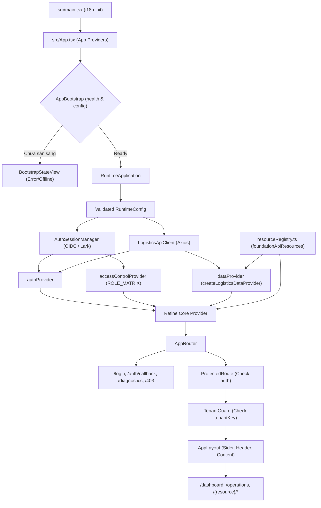

# Báo cáo Audit Hiện trạng Frontend (Frontend Context Current)

> **Tài liệu nguồn sự thật (Source of Truth)**  
> **Dự án**: LogisticsX TMS Web Application (`logictics-app`)  
> **Thời điểm audit**: 04/10/2026 (local time)  
> **Mục đích**: Khảo sát hiện trạng kiến trúc, runtime, contract, screens, types và test suites của frontend React + Refine + Ant Design trước khi lập và thực thi `plan-frontend.md`.

> **Runtime correction — 2026-10-06:** This document retains the original 2026-10-04 audit snapshot. Current execution truth is [plan section 48](../plan-frontend-v2-implementation-ready.md#48-current-execution-matrix) and [progress](plan-frontend-progress.md). Payroll reconciliation, Rating preview, Optimization and Fleet are DONE. GET `/api/me`, multipart Documents and Executive-summary remain absent; legacy report DTOs/parameters are not current compatibility evidence. Historical 2026-10-05 deployment absence is SUPERSEDED BY 2026-10-06 RUNTIME REFRESH. Preserve completed features/tests; frontend-only scope; no production mocks or backend changes.

---

## 1. Repository checkpoint

Trạng thái git ghi nhận trực tiếp tại thời điểm bắt đầu audit:

- **Branch hiện tại**: `KAN-79-integrations-dang-nhap-bang-lark`
- **HEAD commit**: `0eb8bf6 fix(config): provide default VITE_API_BASE_URL and add .env.test for test environments`
- **Working tree status** (`git status --short`):
  ```text
   M src/App.tsx
   M src/hooks/useLarkLogin.ts
   M src/locales/en.ts
   M src/locales/ja.ts
   M src/locales/vi.ts
   M src/pages/auth/LarkCallbackPage.tsx
   M src/pages/auth/LoginPage.tsx
   M src/providers/auth/sessionManager.ts
   M src/providers/authProvider.ts
   M src/tests/providers/auth/sessionManager.test.ts
   M src/tests/providers/authProvider.test.ts
   M src/types/auth.types.ts
   M src/types/authSession.types.ts
  ?? src/tests/hooks/useLarkLogin.test.ts
  ?? src/tests/pages/auth/
  ```
  *(Các thay đổi trên thuộc tính năng Lark Login đang phát triển dở dang của user; kiểm toán viên không reset, checkout, stash hay xóa bất kỳ file nào).*

---

## 2. Actual technology stack

Xác nhận từ `package.json`, `package-lock.json`, `vite.config.ts`, `tsconfig.json`, `tsconfig.app.json`, và `eslint.config.js`:

| Công nghệ / Thư viện | Phiên bản khai báo (`package.json`) | Phiên bản cài đặt thực tế (`package-lock.json`) | Ghi chú kiến trúc |
|---|---|---|---|
| **React** | `^18.3.1` | `18.3.1` | Sử dụng React 18 Concurrent, `createRoot`, `StrictMode` |
| **React DOM** | `^18.3.1` | `18.3.1` | Đi kèm React 18 |
| **TypeScript** | `~6.0.2` | `6.0.3` | Bundler mode (`moduleResolution: "bundler"`, `verbatimModuleSyntax: true`) |
| **Vite** | `^8.1.1` | `8.3.0` | Vite v8 làm build tool & dev proxy |
| **Refine Core** | `^4.58.0` | `4.58.0` | Refine v4 Enterprise framework |
| **Refine Antd** | `^5.47.0` | `5.47.0` | Binding Refine với Ant Design v5 |
| **Refine React Router v6** | `^4.6.2` | `4.6.2` | Router adapter của Refine |
| **Refine Simple REST** | `^5.0.11` | `5.0.11` | Khai báo trong package.json nhưng runtime dùng custom `dataProvider.ts` |
| **Ant Design** | `^5.29.3` | `5.29.3` | Ant Design v5 với CSS-in-JS + SCSS layer |
| **Ant Design Icons** | `^5.6.1` | `5.6.1` | Bộ icon chính của UI |
| **React Router DOM** | `^6.30.3` | `6.30.6` | React Router v6 (v7 flags enabled: `v7_relativeSplatPath`, `v7_startTransition`) |
| **TanStack Query** | `^4.41.0` | `4.44.0` | **TanStack Query v4** (lưu ý: Refine v4 phụ thuộc React Query v4, KHÔNG phải v5) |
| **Axios** | `^1.18.1` | `1.20.0` | HTTP Client duy nhất cho API transport |
| **Dayjs** | `^1.11.21` | `1.11.23` | Tiện ích xử lý date/time |
| **Decimal.js** | `^10.4.3` | `10.6.0` | Tính toán và định dạng tiền tệ chính xác (tránh lỗi số thực IEEE 754) |
| **Leaflet** | `^1.9.4` | `1.9.4` | Map library cho màn hình điều phối vận tải (`@types/leaflet: 1.9.22`) |
| **i18next** | `^26.4.2` | `26.4.2` | Core localization engine |
| **react-i18next** | `^17.0.14` | `17.0.14` | React bindings cho i18n (`vi`, `en`, `ja`) |
| **Zod** | `^4.4.3` | `4.6.5` | Runtime schema validation (config schema, DTO validation) |
| **Recharts** | `^3.10.1` | `3.10.1` | Thư viện biểu đồ (Operations Chart & Financial Section) |
| **OIDC Client** | `^3.1.0` | `3.5.0` | `oidc-client-ts` cho chuẩn OAuth2 Authorization Code + PKCE |
| **Jose** | `^5.9.6` | `5.10.0` | JWT verification và claim verification ở client-side |
| **Sass** | `^1.102.0` | `1.102.0` | CSS Preprocessor cho layout & SCSS modules |
| **Testing Stack** | | | **Vitest** `2.1.9`, **RTL** `16.3.3`, **Jest-DOM** `7.0.1`, **Coverage-v8** `2.1.9`, **jsdom** `30.1.0`, **Playwright** (script `test:e2e`) |

---

## 3. Actual directory tree

Cấu trúc file thực tế quét tối đa 2–3 levels dưới `src/`, `e2e/`, `docs/`:

```text
src/
├── App.tsx                          # Root container, Refine runtime composition
├── main.tsx                         # Client entry point (DOM render, i18n init, CSS import)
├── assets/                          # Static assets (images, svg)
├── components/                      # UI Components dùng chung toàn app
│   ├── AccessibleAnnouncement.tsx
│   ├── ActionButtons.tsx            # Nút Xem/Sửa/Xóa trong table row
│   ├── AntdLocaleProvider.tsx       # Bọc ConfigProvider.locale antd theo i18n
│   ├── AppHeader.tsx                # Header app (User info, Tenant, Language, Notifications)
│   ├── AppLayout.tsx                # Shell layout chung (Sider, Header, Content)
│   ├── AppSider.tsx                 # Sidebar menu tích hợp Refine navigation
│   ├── AppTitle.tsx                 # App logo & title
│   ├── AsyncState.tsx               # AsyncStateView xử lý 4 trạng thái (Loading, Error, Empty, Data)
│   ├── ConfirmActionModal.tsx       # Context-aware confirmation modal (Single-flight)
│   ├── EmptyState.tsx               # Empty state chuẩn hóa
│   ├── EntityPicker.tsx             # Select/Lookup từ Refine resources
│   ├── ErrorStates.tsx              # Error state view
│   ├── FilterBar.tsx                # Thanh tìm kiếm & bộ lọc cho table
│   ├── PageHeader.tsx               # Header trang chuẩn hóa
│   ├── ResourceActionContext.tsx    # Context điều khiển modal show/edit từ row
│   ├── ResourceCreateModal.tsx      # Modal tạo mới resource
│   ├── ResourceCreatePage.tsx       # Route page tạo mới resource
│   ├── ResourceEditModal.tsx        # Modal chỉnh sửa resource
│   ├── ResourceEditPage.tsx         # Route page chỉnh sửa resource
│   ├── ResourceListPage.tsx         # Generic CRUD list page template
│   ├── ResourceShowPage.tsx         # Generic CRUD detail page template
│   ├── StatusTag.tsx                # Tag trạng thái màu chuẩn hóa
│   ├── appNavigation.tsx            # Navigation icons & labels
│   ├── crudColumns.tsx              # Factory tạo cột antd table từ resource definition
│   ├── statusTone.ts                # Ánh xạ trạng thái chuỗi -> StatusTone
│   ├── useLocalizedColumns.tsx      # Hook dịch tự động tiêu đề cột
│   └── resources/                   # Config fields, filters, forms cho resources
│       ├── resourceCapabilities.ts
│       ├── resourceFilterControls.ts
│       ├── ResourceFormFields.tsx
│       └── resourceForms.ts
├── config/                          # Runtime configuration & bootstrap health probe
│   ├── AppBootstrap.tsx             # Gate chặn router khi config/health chưa sẵn sàng
│   ├── BootstrapStateView.tsx
│   ├── RuntimeConfigProvider.tsx
│   ├── bootstrapState.ts
│   ├── env.ts                       # Environment variable fallback
│   ├── healthProbe.ts               # Kiểm tra GET /api/health
│   ├── loadRuntimeConfig.ts         # Tải /runtime-config.json
│   ├── runtimeConfigContext.ts
│   ├── runtimeConfigSchema.ts       # Zod schema cho runtime config
│   ├── types.ts
│   ├── useAppBootstrap.ts
│   └── useRuntimeConfig.ts
├── constants/
│   └── routes.ts                    # Single source of truth cho URL route paths
├── features/                        # Feature-specific components, logic, rules & queries
│   ├── accidents/                   # [BLOCKED_BY_BACKEND]
│   ├── ai-dispatch/                 # [BLOCKED_BY_BACKEND]
│   ├── containers/                  # [BLOCKED_BY_BACKEND]
│   ├── conversations/               # [BLOCKED_BY_BACKEND]
│   ├── customers/                   # Resource definition & column configs
│   ├── documents/                   # Resource definition & column configs
│   ├── dvir/                        # [BLOCKED_BY_BACKEND]
│   ├── employees/                   # Resource definition & column configs
│   ├── executive/                   # Executive Dashboard (North Star, Financial, Health, Aging, Rules, Queries)
│   ├── expenses/                    # [BLOCKED_BY_BACKEND]
│   ├── hos-eld/                     # [BLOCKED_BY_BACKEND]
│   ├── invoices/                    # Resource definition & column configs
│   ├── load-board/                  # [BLOCKED_BY_BACKEND]
│   ├── loads/                       # Resource definition & column configs
│   ├── maintenance/                 # [BLOCKED_BY_BACKEND]
│   ├── notifications/               # Notification bell, unread badge, sound
│   ├── operations/                  # Operations Dashboard (Map, Chart, Fleet tracking)
│   ├── payments/                    # Resource definition & column configs
│   ├── products/                    # [BLOCKED_BY_BACKEND]
│   ├── terminals/                   # Resource definition & column configs
│   ├── trips/                       # Resource definition & column configs
│   └── trucks/                      # Resource definition & column configs
├── formatters/                      # Formatting utilities
│   ├── dateTime.ts                  # ISO date/time parsing, formatting
│   ├── display.ts                   # Empty fallback display
│   ├── intlLocale.ts                # Locale string normalization
│   ├── money.ts                     # Decimal.js money formatting (chính xác số thực)
│   └── number.ts                    # Number clamping & formatting
├── forms/                           # Form utilities
│   ├── FormGrid.tsx                 # Responsive 1/2 cột grid cho Form
│   └── backendFieldErrors.ts        # Ánh xạ lỗi backend vào Antd Form fields
├── hooks/                           # Custom React hooks
│   ├── useApiError.ts
│   ├── useAuthStatus.ts
│   ├── useCurrentTenant.ts
│   ├── useCurrentUser.ts
│   ├── useDebouncedSearch.ts
│   ├── useDiscardConfirm.ts         # Hộp thoại cảnh báo rời form khi có thay đổi chưa lưu
│   ├── useEntityFilters.ts
│   ├── useLarkLogin.ts              # Hook xác thực Lark SSO (redirect & callback)
│   ├── useLogoutUser.ts
│   ├── useSwitchTenant.ts           # Chuyển đổi tenant (buộc tái xác thực IdP)
│   └── useTenantList.ts
├── locales/                         # Đa ngôn ngữ (i18next)
│   ├── en.ts
│   ├── ja.ts
│   ├── vi.ts
│   ├── index.ts
│   └── translate.ts
├── pages/                           # Screen Page components
│   ├── accidents/                   # [BLOCKED]
│   ├── ai-dispatch/                 # [BLOCKED]
│   ├── auth/                        # LoginPage, LarkCallbackPage
│   ├── containers/                  # [BLOCKED]
│   ├── conversations/               # [BLOCKED]
│   ├── customers/                   # List, Show, Create, Edit
│   ├── dashboard/                   # DashboardPage (Executive), OperationsDashboardPage
│   ├── diagnostics/                 # DiagnosticsPage (Kiểm tra hệ thống)
│   ├── documents/                   # List, Show (Create/Edit disable)
│   ├── dvir/                        # [BLOCKED]
│   ├── employees/                   # List, Show, Create, Edit
│   ├── errors/                      # ForbiddenPage (403), NotFoundPage (404)
│   ├── expenses/                    # [BLOCKED]
│   ├── hos-eld/                     # [BLOCKED]
│   ├── invoices/                    # List, Show, Create, Edit
│   ├── load-board/                  # [BLOCKED]
│   ├── loads/                       # List, Show, Create, Edit
│   ├── maintenance/                 # [BLOCKED]
│   ├── notifications/               # List, Show
│   ├── payments/                    # List, Show, Create, Edit
│   ├── products/                    # [BLOCKED]
│   ├── tenant/                      # SelectTenantPage
│   ├── terminals/                   # List, Show, Create, Edit
│   ├── trips/                       # List, Show, Create, Edit
│   ├── trucks/                      # List, Show, Create, Edit
│   ├── index.ts                     # Aggregation & route-component mapping
│   ├── resourceConfig.ts            # Helper tạo Refine resource
│   └── resourceRegistry.ts          # foundationApiResources & supportedNames allowlist
├── providers/                       # Refine Providers & API Transports
│   ├── accessControlProvider.ts     # Role matrix AccessControl
│   ├── authProvider.ts              # OIDC, DevAuth & Lark AuthProvider
│   ├── dataProvider.ts              # Logistics custom Refine DataProvider
│   ├── i18nProvider.ts              # Refine i18n provider
│   ├── notificationProvider.ts      # Antd notification provider
│   ├── api/                         # Axios client, envelope, errors, query serializer
│   ├── auth/                        # SessionManager, OidcGateway, DemoAuthSession, JwtVerifier
│   └── permissions/                 # RoleMatrix, JwtRoles, TenantRoleClaims
├── router/                          # Routing logic & route guards
│   ├── AppRouter.tsx                # Master Routes definition
│   ├── FullPageLoader.tsx
│   ├── ProtectedRoute.tsx           # Authenticated check
│   └── TenantGuard.tsx              # Tenant requirement guard
├── styles/                          # Global SCSS, design tokens, mixins
│   ├── _components.scss
│   ├── _mixins.scss
│   ├── _utilities.scss
│   ├── _variables.scss
│   ├── app.scss
│   └── global.scss
├── table/                           # Table abstractions
│   └── BaseTable.tsx                # Bảng chuẩn hóa kết nối với Refine useTable
├── tests/                           # Unit & integration tests (59 files, 302 tests)
├── types/                           # TypeScript DTOs, domain models, enums (38 files)
└── utils/                           # Async state model, single flight helpers
    ├── asyncStateModel.ts
    └── singleFlight.ts

e2e/
└── bootstrap.spec.ts                # Playwright end-to-end bootstrap spec

docs/
├── adr/
│   └── 001-unified-runtime-foundation.md # Quyết định kiến trúc chuẩn hóa foundation
├── backend-gaps.md                  # Sổ tay ghi nhận các lỗ hổng/chặn từ phía backend
├── design/                          # Specs HTML mockup
├── foundation-integration-contract.md # Hợp đồng tích hợp backend - frontend
├── phase-0-foundation.md
└── phase-1-production-readiness.md
```

### Đánh giá các thư mục legacy (`app`, `core`, `shared`, `common`)
- **Kiểm tra thực tế**: Trong `src/`, **hoàn toàn KHÔNG tồn tại** các thư mục `src/app`, `src/core`, `src/shared`, `src/common`.
- **Duy nhất**: Có file `src/types/common.types.ts` chứa các kiểu dữ liệu dùng chung (`Money`, `Address`, `GeoLocation`).
- **Kết luận**: Cấu trúc hiện tại đã được tổ chức theo module chức năng (`components`, `features`, `pages`, `providers`, `router`, `config`, `types`, `hooks`, `utils`). Không có technical debt về việc tồn tại song song thư mục `core`/`shared` cũ.

---

## 4. Bootstrap / Refine runtime

### 4.1 Quy trình khởi tạo (Bootstrap Lifecycle)
1. **Entry Point (`src/main.tsx`)**:
   - Gọi `initializeAppI18n({ locale: "vi", fallbackLocale: "en" })`.
   - Render `<App i18n={i18n} />` bọc trong `StrictMode`.
2. **Bootstrap Shell (`src/App.tsx` & `src/config/AppBootstrap.tsx`)**:
   - Tải `loadRuntimeConfig()` (`/runtime-config.json` hoặc fallback `.env`).
   - Xác thực schema runtime config qua `runtimeConfigSchema` (Zod).
   - Chạy `probeApiHealth()` gửi `GET /api/health`. Nếu `status !== "UP"` hoặc `database !== "enabled"`, router bị chặn và hiển thị `BootstrapStateView`.
3. **Runtime Composition (`RuntimeApplication` trong `src/App.tsx`)**:
   - Chỉ khi bootstrap `READY`, `RuntimeApplication` mới khởi tạo các singleton scoped theo config:
     - `AuthSessionManager` + `DemoAuthSession` (trong dev).
     - `createApiClient`: Cấu hình base URL, timeout, Axios interceptors, token provider.
     - `createCurrentUserLoader`: Nạp thông tin `/api/me`.
     - `createAuthProvider`: Xử lý login OIDC, Lark callback, logout, check session.
     - `createAccessControlProvider`: Nhúng ma trận quyền `ROLE_MATRIX`.
     - `createLogisticsDataProvider`: Khởi tạo Refine DataProvider gắn với `foundationApiResources`.
     - `createFoundationResources(t)`: Lọc resource hợp lệ và dịch nhãn menu.
     - `AppRouter`: Dựng cây route React Router v6.

### 4.2 Sơ đồ luồng phụ thuộc (Dependency Flow Diagram)



---

## 5. Authentication & Authorization

### 5.1 Token Storage & Session Behavior
- **OIDC Tokens (Production)**:
  - Sử dụng Authorization Code Flow với PKCE (`oidc-client-ts`).
  - **Lưu trữ**: Token được lưu trữ **hoàn toàn trong Memory** (`InMemoryWebStorage`). Khi reload tab hoặc mở tab mới, session được khôi phục qua `UserManager.getUser()`. Trạng thái tạm (state, nonce, PKCE verifier) nằm trong `sessionStorage`.
  - **Refresh Token**: Thực hiện ngầm định qua `AuthSessionManager.refreshSession()` (single-flight coordinator). Có `refreshSkewSeconds = 60s` để chủ động refresh trước khi token hết hạn.
  - **401 Replay**: Axios response interceptor cho phép tối đa 1 lần refresh và tự động replay request. Request bị 403 tuyệt đối không kích hoạt refresh hay logout.
- **Lark SSO Authentication**:
  - Giao thức: Lark OAuth Authorization Code.
  - Khởi tạo redirect: `useLarkLogin().startLogin(returnTo)` -> chuyển hướng đến `larkLoginUrl` (`/api/auth/lark/login` hoặc cấu hình qua env).
  - Callback: Nhận `code`, `state` tại `/auth/callback` (`LarkCallbackPage`), gọi POST `/api/auth/lark/callback`.
  - Lưu trữ: Lưu vào `sessionStorage` với key `logistics_lark_session` (`AuthSessionSnapshot`).
- **Demo / Dev Auth**:
  - Khi `import.meta.env.DEV && featureFlags.demoAuth && env.demoAuth !== null`:
  - POST `/api/dev-auth/login` với username/password.
  - Session lưu trong memory (`DemoAuthSession`).

### 5.2 Tenant Resolution & Behavior
- **Quy tắc tuyệt đối**: Frontend **KHÔNG BAO GIỜ** tự gửi header `X-Tenant`, `X-Tenant-Id`, hoặc query parameter tenant tùy tiện.
- **Cơ chế**: Tenant được giải quyết và ký số trực tiếp từ backend bên trong JWT access token (`claim tenant` hoặc `tenantId`).
- **Kiểm tra biên (Boundary Check)**: Trong `src/providers/auth/currentUser.ts`:
  ```ts
  const boundaryMatches =
    response.data.subject === identity.id &&
    response.data.tenantId === identity.tenantId &&
    sameRoles(roles, identity.roles);
  ```
  Nếu có bất kỳ sự sai lệch nào giữa token claims và dữ liệu trả về từ `/api/me`, frontend lập tức xóa toàn bộ session và buộc đăng nhập lại.
- **Chuyển Tenant (`useSwitchTenant`)**:
  - Frontend không gọi API "đổi tenant" nội bộ.
  - Muốn đổi tenant, hook `useSwitchTenant` hủy toàn bộ query cache và kích hoạt luồng OIDC login với `forceReauthentication: true` để Identity Server cấp token mới chứa tenant mới.

### 5.3 Role Matrix & Permission Mapping
- **Nguồn JWT Roles**: Định nghĩa tại `src/types/roles.types.ts`: `SUPERADMIN`, `OWNER`, `MANAGER`, `DISPATCHER`, `DRIVER`.
- **Ma trận quyền (`src/providers/permissions/roleMatrix.ts`)**:
  - Fail-closed: Mọi resource/action không nằm trong whitelist đều bị từ chối (`can = false`). Ngay cả `SUPERADMIN` cũng không được phép truy cập resource chưa được contract mô tả.
  - `CanAccess` / `ResourceAccessBoundary`: Bọc quanh từng route nghiệp vụ và nút bấm (`ActionButtons`, `CreateButton`).

---

## 6. API Client & Data Provider

### 6.1 Bảng phân tích chi tiết (Concern vs Current Implementation)

| Concern | Hiện trạng triển khai tại Frontend (`src/providers/api/`) |
|---|---|
| **Base URL** | Lấy từ `runtimeConfig.apiBaseUrl` (chuẩn hóa bằng `normalizeApiBaseUrl`, mặc định fallback sang `VITE_API_BASE_URL` hoặc proxy `/api`). |
| **Auth Header** | Tự động chèn `Authorization: Bearer <token>` thông qua Axios request interceptor (`apiClient.ts`). Bỏ qua khi request cấu hình `logistics.authentication: "none"`. |
| **Envelope** | Chuẩn JSON backend Spring: `{ success: boolean, code: string, message: string, data: T, errors: BackendApiError[], meta: ResponseMeta }`. Interceptor tự unwrap lấy `response.data = envelope.data`. Hỗ trợ pass-through cho HTTP 204 hoặc `responseMode: "raw"`. |
| **Error Normalization** | Chuẩn hóa qua `normalizeHttpError` / `toRefineHttpError`. Bóc tách lỗi trường (`fieldErrors: Record<string, string[]>`) và gán mã lỗi `code`, `requestId` (từ envelope hoặc response header `X-Request-Id`). |
| **Pagination** | 1-based pagination (`page`, `pageSize`). Mặc định `page = 1`, `pageSize = 20`, giới hạn trần `MAX_LIST_PAGE_SIZE = 100`. Bóc tách từ `PagedResponse` (`totalItems`, `totalPages`, `currentPage`, `pageSize`). |
| **Sorting** | Truyền qua query params `orderBy` và `descending: boolean`. Chỉ hỗ trợ tối đa 1 tiêu chí sort; ném lỗi `MULTIPLE_SORT_FIELDS_NOT_SUPPORTED` nếu truyền nhiều hơn. Kiểm tra với `allowedSortFields`. |
| **Filters** | Chỉ hỗ trợ filter phẳng (`CrudFilters`), toán tử `eq` hoặc `contains`. Ném lỗi `UNSUPPORTED_CONDITIONAL_FILTER` nếu dùng `and`/`or`. Kiểm tra trường filter với `allowedFilterFields`. |
| **AbortSignal** | Trích xuất `meta.queryContext.signal` từ TanStack Query truyền vào Axios config. Đồng thời tích hợp `createLatestRequestCoordinator` để tự động cancel request tìm kiếm/danh sách cũ bị lỗi thời khi có query mới. |
| **Retry** | **Axios layer**: Tự động refresh token và replay 1 lần duy nhất cho lỗi HTTP 401. **TanStack Query layer**: Hàm `shouldRetryQuery` chỉ retry tối đa 2 lần cho lỗi mạng (`statusCode === 0`) hoặc lỗi server 5xx (`statusCode >= 500`). Tuyệt đối không retry lỗi vi phạm protocol (`INVALID_*`) hoặc 4xx. |
| **Cache** | Được quản lý bởi `@tanstack/react-query` v4. Query key theo chuẩn Refine v4 (`["data", resource, action, params]`). Xóa toàn bộ cache khi đăng xuất hoặc đổi tenant. |

### 6.2 Phân định Generic DataProvider vs Custom API
- **Sử dụng Refine Generic DataProvider** (`createLogisticsDataProvider`):
  - 10 resources hoạt động: `customers`, `employees`, `terminals`, `trucks`, `loads`, `trips`, `invoices`, `payments`, `documents` (chỉ list/show/delete), `notifications` (chỉ list/show).
  - 2 lookup resources: `drivers`, `roles`.
- **Sử dụng Custom API / `useCustom`**:
  - Executive Overview Dashboard (`src/features/executive/executive.queries.ts`): Gọi 6 aggregate endpoints:
    1. `GET /api/reports/executive-summary`
    2. `GET /api/reports/financials/monthly`
    3. `GET /api/reports/costs/by-category`
    4. `GET /api/reports/fleet/health`
    5. `GET /api/reports/customers/concentration`
    6. `GET /api/reports/receivables/aging`
  - Auth endpoints:
    - `POST /api/dev-auth/login`
    - `POST /api/auth/lark/callback`
    - `GET /api/me`
    - `GET /api/health`

---

## 7. Fetching & Caching behavior

| Màn hình chính | API gọi khi Mount / Focus | API gọi khi User Action / Tab Open | Cơ chế Prefetch | Batch Fetch khi Startup | Cấu trúc Query Key | Cơ chế Mutation Invalidation |
|---|---|---|---|---|---|---|
| **Executive Dashboard** (`/dashboard`) | 6 endpoints `/api/reports/**`, `GET /api/trucks?pageSize=1`, `GET /api/customers?pageSize=1` | Gọi lại 6 report endpoints khi đổi bộ lọc thời gian (`rangeMonths`) | Không có cross-screen prefetch | Không batch chung; 6 query chạy song song qua `useCustom` | `["custom", "/api/reports/...", { query }]` | Read-only reporting, không có mutation trực tiếp |
| **Operations Dashboard** (`/operations`) | `GET /api/trucks?pageSize=100`, `GET /api/loads?pageSize=1`, `GET /api/trips?pageSize=1` | Refetch ngầm mỗi 30s (`staleTime: 30_000`) | Không | 3 queries độc lập | `["data", "trucks", "getList", ...]`, tương tự cho loads, trips | Bị vô hiệu hóa cache khi các màn CRUD tương ứng tạo/sửa bản ghi |
| **Generic List Pages** (`/customers`, `/trucks`, ...) | `GET /api/{resource}?page=1&pageSize=20...` | Khi đổi trang, đổi sort, nhập từ khóa tìm kiếm (debounced 300ms) | Không | Không | `["data", "{resource}", "getList", { pagination, filters, sorters }]` | Refine tự động invalidate `getList` của resource đó sau khi `create`, `update`, hoặc `deleteOne` thành công |
| **Generic Show/Edit Modals** | Chỉ fetch `GET /api/{resource}/:id` khi user click Xem/Sửa trên dòng | Đóng mở modal hoặc đổi ID bản ghi | Không | Không | `["data", "{resource}", "getOne", id]` | Tự động invalidate `getOne` và `getList` khi submit thành công |
| **App Header / Shell** | `GET /api/me`, `GET /api/notifications?pageSize=1` (lấy badge chưa đọc) | User mở popover thông báo hoặc đổi ngôn ngữ | Không | Không | `["auth", "identity"]`, `["data", "notifications", "getList", ...]` | Đăng xuất hoặc đổi tenant gọi `queryClient.cancelQueries` & `removeQueries` |

---

## 8. Route & Screen inventory

Bảng thống kê toàn bộ 27 màn hình/resource được yêu cầu kiểm toán:

| Resource / Screen | Route | Page Component | API Endpoint | CRUD / Action | Permission (Role Matrix) | Trạng thái hiện tại |
|---|---|---|---|---|---|---|
| **dashboard** (Executive) | `/dashboard` | `DashboardPage.tsx` | `/api/reports/**` (6 endpoints) | Read / Metrics Overview | Mọi user đã xác thực | **COMPLETE** |
| **operations** (Operations) | `/operations` | `OperationsDashboardPage.tsx` | `/api/trucks`, `/api/loads`, `/api/trips` | Read / Map Tracking | Phụ thuộc quyền xem xe/hàng/chuyến | **COMPLETE** |
| **customers** | `/customers/*` | `CustomerList`, `Create`, `Edit`, `Show` | `/api/customers` | Full CRUD | `SUPERADMIN`, `OWNER`, `MANAGER` | **COMPLETE** |
| **employees** | `/employees/*` | `EmployeeList`, `Create`, `Edit`, `Show` | `/api/employees`, `/api/roles` | Full CRUD | `SUPERADMIN`, `OWNER` | **COMPLETE** |
| **drivers** | N/A | Không có trang riêng (nằm trong relation picker của xe) | `/api/drivers` | Read-only lookup | `NON_DRIVER_ROLES` | **PARTIAL** |
| **trucks** | `/trucks/*` | `TruckList`, `Create`, `Edit`, `Show` | `/api/trucks`, `/api/drivers` | Full CRUD | `NON_DRIVER_ROLES` | **COMPLETE** |
| **loads** | `/loads/*` | `LoadList`, `Create`, `Edit`, `Show` | `/api/loads`, `/api/customers`, `/api/terminals` | Full CRUD, dispatch, pickup, deliver | Tất cả (Driver chỉ đọc/nhận/giao) | **COMPLETE** |
| **trips** | `/trips/*` | `TripList`, `Create`, `Edit`, `Show` | `/api/trips`, `/api/trucks` | Full CRUD, dispatch, complete | Tất cả (Driver chỉ đọc) | **COMPLETE** |
| **terminals** | `/terminals/*` | `TerminalList`, `Create`, `Edit`, `Show` | `/api/terminals` | Full CRUD | Tạo/Sửa: Non-driver; Xóa: Quản trị | **COMPLETE** |
| **invoices** | `/invoices/*` | `InvoiceList`, `Create`, `Edit`, `Show` | `/api/invoices`, `/api/loads`, `/api/customers` | Full CRUD | Đọc: Non-driver; Ghi: Kế toán | **COMPLETE** |
| **payments** | `/payments/*` | `PaymentList`, `Create`, `Edit`, `Show` | `/api/payments`, `/api/invoices` | Full CRUD | Đọc: Non-driver; Ghi: Kế toán | **COMPLETE** |
| **expenses** | `/expenses/*` | `ExpenseList`, `Create`, `Edit`, `Show` | Không có CRUD endpoint | N/A | Chưa có trong ma trận | **BLOCKED_BY_BACKEND** |
| **maintenance** | `/maintenance/*` | `MaintenanceList`, `Create`, `Edit`, `Show` | Không có CRUD endpoint | N/A | Chưa có trong ma trận | **BLOCKED_BY_BACKEND** |
| **inspections** (dvir) | `/dvir/*` | `DvirList`, `Create`, `Edit`, `Show` | Không có CRUD endpoint | N/A | Role matrix có `inspections` | **BLOCKED_BY_BACKEND** |
| **documents** | `/documents/*` | `DocumentList`, `DocumentShow` | `/api/documents` | Read, Delete (Chưa có UI Upload) | Tất cả (Xóa: Non-driver) | **PARTIAL** |
| **messages** (conversations) | `/conversations/*` | `ConversationList`, `Show` | `/api/messages/conversations` (Chưa tích hợp generic) | N/A | Role matrix có quy định | **BLOCKED_BY_BACKEND** |
| **notifications** | `/notifications/*` | `NotificationList`, `NotificationShow` | `/api/notifications` | List, Show, Mark Read (No delete/create) | Tất cả | **PARTIAL** |
| **profile** | N/A | Không có trang `/profile` riêng | `/api/me` | Read identity | Tất cả | **MISSING** |
| **shipment costs** | N/A | Chưa có | N/A | N/A | N/A | **MISSING** |
| **profitability** | N/A | Nằm trong Executive Overview | N/A | N/A | N/A | **MISSING** |
| **accessorial charges** | N/A | Chưa có | N/A | N/A | N/A | **MISSING** |
| **settlements** | N/A | Chưa có | N/A | N/A | N/A | **MISSING** |
| **payroll** | N/A | Chưa có (chỉ có type trong hóa đơn) | N/A | N/A | N/A | **MISSING** |
| **payslips** | N/A | Chưa có | N/A | N/A | N/A | **MISSING** |
| **rate rules** | N/A | Chưa có | N/A | N/A | N/A | **MISSING** |
| **optimization** | N/A | Chưa có | N/A | N/A | N/A | **MISSING** |
| **fleet utilization** | N/A | Tích hợp trong Executive & Operations | `/api/reports/executive-summary` | Metric Tile | Tất cả | **PARTIAL** |

*Tổng kết trạng thái màn hình*:
- **COMPLETE**: 10 screens
- **PARTIAL**: 4 screens
- **BLOCKED_BY_BACKEND**: 5 screens
- **MISSING**: 8 screens

---

## 9. Resource ↔ Endpoint contract matrix

| Endpoint thực tế | Phương thức | Query Params / Body | Response DTO | Kiểu dữ liệu Frontend | Runtime Validation | Màn hình sử dụng | Đánh giá Contract |
|---|---|---|---|---|---|---|---|
| `/api/health` | GET | Không | `{ application, database, profiles, status }` | `HealthProbeResponse` | Có (Zod / Predicate) | `AppBootstrap` | **MATCH** |
| `/api/dev-auth/login` | POST | `{ email, password }` | `{ accessToken, tokenType, expiresIn, subject, email, tenantId, roles }` | `DevAuthLoginResponse` | Có (`isDevAuthLoginResponse`) | `LoginPage` | **MATCH** |
| `/api/auth/lark/callback` | POST | `{ code, state, returnTo, error, errorDescription }` | `LarkAuthLoginResponse` | `LarkAuthLoginResponse` | Có (TypeScript check) | `LarkCallbackPage` | **MATCH** |
| `/api/me` | GET | Không | `{ subject, email, tenantId, roles, employeeId }` | `CurrentUserResponse` / `CurrentUser` | Có (`isCurrentUserResponse` + Boundary check) | Auth Loader, `AppHeader`, Guards | **MATCH** |
| `/api/customers` | GET, POST | Params: `page`, `pageSize`, `search`, `status`, `orderBy`, `descending`. Body: `CustomerDto` | `PagedResponse<CustomerDto>` | `Customer` / `CustomerDto` | Paged envelope validation | `CustomerList`, `CustomerCreate`, `Edit` | **MATCH** |
| `/api/employees` | GET, POST | Params: `search`, `status`, `roleId`, sort... | `PagedResponse<EmployeeDto>` | `Employee` / `EmployeeDto` | Paged envelope validation | `EmployeeList`, `Create`, `Edit` | **MATCH** |
| `/api/terminals` | GET, POST | Params: `search`, `type`, `countryCode`, sort... | `PagedResponse<TerminalDto>` | `Terminal` / `TerminalDto` | Code pattern 5 chữ hoa, country 2 chữ hoa | `TerminalList`, `Create`, `Edit` | **MATCH** |
| `/api/trucks` | GET, POST | Params: `search`, `status`, `type`, sort... | `PagedResponse<TruckDto>` | `Truck` / `TruckDto` | Paged envelope validation | `TruckList`, `OperationsDashboard` | **MATCH** |
| `/api/loads` | GET, POST | Params: `search`, `status`, `customerId`, `truckId`, `dispatcherId`... | `PagedResponse<LoadResponse>` | `Load` / `LoadResponse` | Enum validation trong form (`5 trạng thái`) | `LoadList`, `Create`, `Edit` | **CONTRACT_MISMATCH** *(Lệch kiểu Date vs string giữa DTO và domain entity)* |
| `/api/trips` | GET, POST | Params: `search`, `status`, `truckId`... | `PagedResponse<TripDto>` | `Trip` / `TripDto` | Form.List stops validation | `TripList`, `Create`, `Edit` | **MATCH** |
| `/api/invoices` | GET, POST | Params: `status`, `type`, `customerId`, `employeeId`... | `PagedResponse<InvoiceDto>` | `Invoice` / `InvoiceDto` | Paged envelope validation | `InvoiceList`, `Create`, `Edit` | **CONTRACT_MISMATCH** *(Backend search không lọc theo date range)* |
| `/api/payments` | GET, POST | Params: `status`, `invoiceId`... | `PagedResponse<PaymentDto>` | `Payment` / `PaymentDto` | Paged envelope validation | `PaymentList`, `Create`, `Edit` | **MATCH** |
| `/api/documents` | GET, DELETE | Params: `type`, `status`, `loadId`, `truckId`, `employeeId`... | `PagedResponse<DocumentDto>` | `Document` / `DocumentDto` | Paged envelope validation | `DocumentList`, `DocumentShow` | **CONTRACT_MISMATCH** *(POST đòi hỏi multipart/form-data, chưa có form UI)* |
| `/api/notifications` | GET | Params: `page`, `pageSize` | `PagedResponse<NotificationDto>` | `Notification` | Paged envelope validation | `NotificationList`, `NotificationShow` | **MATCH** |
| `/api/drivers` | GET | Params: `search`, `status` | `PagedResponse<DriverDto>` | `Driver` / `Employee` | Paged envelope validation | `EntityPicker` trong form Xe | **MATCH** |
| `/api/roles` | GET | Params: `search` | `PagedResponse<RoleDto>` | `Role` | Paged envelope validation | `EntityPicker` trong form Nhân viên | **MATCH** |
| `/api/reports/executive-summary` | GET | `currency`, `from`, `to` | `ExecutiveSummaryDto` | `ExecutiveSummaryDto` | Strict `toMetric` check (`available: true` + `isFinite`) | `DashboardPage` | **MATCH** |
| `/api/reports/financials/monthly` | GET | `currency`, `from`, `to` | `MonthlyFinancialsDto` | `MonthlyFinancialsDto` | Strict `toMetric` check | `DashboardPage` (FinancialSection) | **MATCH** |
| `/api/reports/costs/by-category` | GET | `currency`, `from`, `to` | `CostBreakdownDto` | `CostBreakdownDto` | Strict `toMetric` check | `DashboardPage` (CostSection) | **MATCH** |
| `/api/reports/fleet/health` | GET | `currency`, `from`, `to` | `FleetHealthDto` | `FleetHealthDto` | Strict `toMetric` check | `DashboardPage` (FleetHealthSection) | **MATCH** |
| `/api/reports/customers/concentration` | GET | `currency`, `from`, `to`, `limit` | `CustomerConcentrationDto` | `CustomerConcentrationDto` | Strict `toMetric` check | `DashboardPage` (CustomerSection) | **MATCH** |
| `/api/reports/receivables/aging` | GET | `currency`, `from`, `to` | `ReceivablesAgingDto` | `ReceivablesAgingDto` | Strict `toMetric` check | `DashboardPage` (AgingSection) | **MATCH** |

---

## 10. Dashboard context (Executive & Operations)

### 10.1 Triết lý thiết kế số liệu điều hành
- **Nguyên tắc "Không có số nghĩa là không có số"**:
  - Giao diện không bao giờ tự ý chuyển `null`, `undefined` hoặc lỗi mạng thành `0`.
  - Giá trị chỉ được coi là hợp lệ khi `available === true && typeof value === "number" && Number.isFinite(value)`.
  - Nếu `available === false`, hiển thị trạng thái `unavailable` kèm mã lý do backend trả về (`NO_SOURCE_ROWS`, `NO_AVAILABILITY_HISTORY`, `NO_TOTAL_MILES_SOURCE`, `NOT_IMPLEMENTED`...).
- **Tiền tệ chuẩn**: Cố định `DISPLAY_CURRENCY = "VND"` khớp với dữ liệu thực của cơ sở dữ liệu tenant. Tuyệt đối không tự ý quy đổi tỷ giá ở frontend.
- **Phân biệt hai Dashboard**:
  - `DashboardPage` (`/dashboard`): Executive Overview cho Ban Giám đốc (30 giây trả lời sức khỏe doanh nghiệp, xu hướng tài chính, rủi ro nợ và tập trung khách hàng).
  - `OperationsDashboardPage` (`/operations`): Màn hình điều phối vận hành thời gian thực (vị trí xe trên bản đồ Leaflet, số chuyến đi, khối lượng hàng đang chạy hôm nay).

### 10.2 Bảng phân loại Metric Executive Dashboard

| Chỉ số (Metric) | Nguồn Endpoint / DTO Field | Đánh giá | Trạng thái hiển thị khi thiếu dữ liệu | Ghi chú & Xuất xứ Benchmark |
|---|---|---|---|---|
| **fleetUtilization** | `/api/reports/executive-summary` (`fleetUtilizationPct`) | **REAL** | `UNAVAILABLE` (`NO_AVAILABILITY_HISTORY`) | Target nội bộ: 84% (Long haul) / 80% (Regional). Backend trả `unavailable` do thiếu dữ liệu lịch sử trạng thái xe. |
| **loadedMiles** | `/api/reports/executive-summary` (`loadedMilesPct`) | **REAL** | `UNAVAILABLE` (`NO_TOTAL_MILES_SOURCE`) | Target nội bộ: 87%, Industry Benchmark ATRI: 82%. Backend chưa có nguồn tính tổng dặm (deadhead miles). |
| **deadhead** | N/A | **UNAVAILABLE** | Không hiển thị độc lập | Không nằm trong hợp đồng backend, frontend không tự tính lấy `100 - loadedMiles`. |
| **OTD (On-Time Delivery)** | `/api/reports/executive-summary` (`onTimeDeliveryPct`) | **REAL** | Hiển thị giá trị thực nếu có | Target: 95%, ATRI: 94%. |
| **DIFOT** | `/api/reports/executive-summary` (`difotPct`) | **REAL** | `UNAVAILABLE` (`NOT_IMPLEMENTED`) | Target: 94%, ATRI: 92%. Backend tạm trả `NOT_IMPLEMENTED`. |
| **unplannedDowntime** | `/api/reports/fleet/health` (`unplannedDowntimePct`) | **REAL** | `UNAVAILABLE` (`NO_DOWNTIME_INTERVALS`) | Target: 4%. Backend hardcode `NO_DOWNTIME_INTERVALS` vì chưa phân loại khoảng dừng xe. |
| **PM compliance** | `/api/reports/fleet/health` (`pmCompliancePct`) | **REAL** | Hiển thị giá trị thực | Target: 95%. Tính từ ngày hạn bảo trì định kỳ của xe. |
| **maintenanceCostPerMile** | `/api/reports/fleet/health` (`maintenanceCostPerMile`) | **REAL** | Hiển thị giá trị thực (VND/mile) | Target: 0.165 USD tương đương trong VND. |
| **breakdownsPer100kMiles** | `/api/reports/fleet/health` (`breakdownsPer100kMiles`) | **REAL** | `UNAVAILABLE` (`NOT_IMPLEMENTED`) | Target: 1.8. Cần backend phân loại sự cố hỏng hóc trên đường. |
| **revenue** | `/api/reports/financials/monthly` (`points[].revenue`) | **REAL** | Hiển thị theo tháng hoặc lý do trống | Số liệu tổng hợp từ các hóa đơn thực tế. |
| **operatingCost** | `/api/reports/financials/monthly` (`points[].operatingCost`) | **REAL** | Hiển thị theo tháng hoặc lý do trống | Số liệu tổng hợp từ các phiếu chi (`Expense`). |
| **CPM (Cost Per Mile)** | `/api/reports/financials/monthly` (`points[].costPerMile`) | **REAL** | Lấy tháng gần nhất có số | North Star Metric. ATRI 2025: $2.30. |
| **RPM (Revenue Per Mile)** | `/api/reports/financials/monthly` (`points[].revenuePerMile`) | **REAL** | Lấy tháng gần nhất có số | North Star Metric. Target: 2.58. |
| **margin (operatingMargin)** | Không có trong response nào | **UNAVAILABLE** | `UNAVAILABLE` (`notInContract`) | Backend không trả về trong bất kỳ endpoint nào; frontend từ chối tự bịa công thức. |
| **revenueGrowth** | Không có trong response nào | **UNAVAILABLE** | `UNAVAILABLE` (`notInContract`) | Tương tự operatingMargin, đánh dấu không có trong contract. |
| **DSO / receivables** | `/api/reports/receivables/aging` (`dsoDays`, `outstandingTotal`) | **REAL** | Hiển thị 6 buckets tuổi nợ | Rất chính xác: tính từ hóa đơn - thanh toán, miễn nhiễm lỗi viết hoa chữ thường `Draft`/`draft`. |

---

## 11. Forms & Validation

### 11.1 Kiến trúc Forms
- **Tầng Form Core**: Dựa trên `@refinedev/antd` `useForm` (cho route page) và `useModalForm` (cho popup modal).
- **Trình bày Form**: Sử dụng `ResourceFormFields` phối hợp `FormGrid` (xếp 2 cột cho full page, 1 cột cho modal rộng ~520px). Các trường dài như `textarea`, `tripStops` tự động chiếm full width (100%).
- **Xử lý Server-side Field Errors**:
  - Khi API trả về HTTP 422 hoặc lỗi validation dạng `{ field: "email", message: "..." }`, hàm `applyBackendFieldErrors` (`src/forms/backendFieldErrors.ts`) bóc tách mảng lỗi, gán trực tiếp vào Ant Design Form qua `form.setFields()`, và tự động scroll/focus vào ô nhập lỗi đầu tiên.

### 11.2 Các quy ước nhập liệu (Conventions)
1. **Tạo mới / Chỉnh sửa (Create / Edit)**:
   - Các trường do server sở hữu (như `isInProximity`, `stripePaymentMethodId`) được đánh dấu `readOnly: true`, render dạng `disabled`. Ant Design giữ nguyên giá trị trong form store để gửi lại đầy đủ khi update (an toàn cho cả full PUT và partial PATCH). Lúc create, các trường này không có giá trị khởi tạo nên bị loại khỏi JSON payload.
2. **Xác nhận thao tác phá hủy (Destructive Actions)**:
   - Sử dụng `ConfirmActionModal` (`src/components/ConfirmActionModal.tsx`) tích hợp `AntdApp.useApp().modal.confirm` với single-flight lock (`runSingleFlight`), ngăn chặn click đúp tạo nhiều modal hoặc gửi lặp request xóa.
3. **Cảnh báo thay đổi chưa lưu (Discard Changes)**:
   - Sử dụng hook `useDiscardConfirm` (`src/hooks/useDiscardConfirm.ts`). Bắt sự kiện `onCancel` của modal, kiểm tra trạng thái dirty qua `useWarnAboutChange()` của Refine, và hiển thị hộp thoại xác nhận của Ant Design (thay thế hộp thoại `window.confirm` mặc định của trình duyệt).
4. **Tiền tệ (Money)**:
   - Form phân tách thành 2 trường riêng biệt: số lượng (`deliveryCostAmount`, `totalAmount`) dùng `InputNumber` và mã tiền tệ (`deliveryCostCurrency`, `totalCurrency`) dùng `Input`.
5. **Ngày tháng (Date / Time)**:
   - Sử dụng `<Input type="datetime-local">` hoặc DatePicker, format ISO-8601 UTC có timezone offset/Z qua `dateTime.ts`.
6. **Email & Phone**:
   - Email kiểm tra chuẩn regex email của Ant Design Form Rule. Phone nhập text tự do do backend hỗ trợ format quốc tế.
7. **Tải lên tập tin (File Upload)**:
   - Chưa có UI upload hoàn chỉnh. Axios Client đã hỗ trợ multipart boundary stripping tự động khi payload là `FormData`. Màn hình `documents` hiện tại tạm khóa chức năng tạo mới qua giao diện Refine.

---

## 12. Design System / UX context

| Thành phần | Hiện trạng thực tế |
|---|---|
| **Theme & Màu sắc** | Ant Design v5 default theme kết hợp hệ thống SCSS variables (`src/styles/_variables.scss`). Tone màu thương hiệu: Primary Blue (`#1677ff`), Success (`#52c41a`), Warning (`#faad14`), Error (`#ff4d4f`). |
| **Typography** | Font hệ thống (`-apple-system, BlinkMacSystemFont, 'Segoe UI', Roboto, 'Helvetica Neue', Arial...`). Typography Title và Text từ Ant Design. |
| **Spacing & Layout** | Grid layout Ant Design (`Row`, `Col`, `Space`, `gutter={[16, 16]}`). Shell gồm `AppSider` có thể collapse, `AppHeader` cố định, và breadcrumbs. |
| **Table Density & BaseTable** | Chuẩn hóa qua `BaseTable` (`src/table/BaseTable.tsx`). Hỗ trợ cuộn ngang `scroll={{ x: "max-content" }}`, phân trang chuẩn server-side, giữ nguyên tiêu đề cột khi table rỗng. |
| **Status Tags** | Chuẩn hóa tập trung tại `src/components/statusTone.ts`. Mọi trạng thái từ backend được chuẩn hóa lowercase và gán vào 5 tone: `success` (active, completed, paid), `processing` (dispatched, in_transit), `warning` (maintenance, pending), `error` (cancelled, failed), `neutral` (draft, inactive). |
| **Loading States** | Spinner `Spin` của Ant Design, `FullPageLoader` cho route-level transitions, skeleton loader cho statistic cards. |
| **Empty & Error States** | `EmptyState` hiển thị icon và thông báo đa ngôn ngữ khi không có dữ liệu. `QueryErrorState` hiển thị nút Retry để refetch query. |
| **Responsive & Mobile** | Hỗ trợ responsive cơ bản thông qua Ant Design grid breakpoints (`xs`, `sm`, `md`, `lg`, `xl`). Menu sidebar tự thu gọn trên màn hình nhỏ. |
| **Modals / Drawers** | Modal xem chi tiết và form chỉnh sửa nhanh được tích hợp sẵn trên từng dòng danh sách, giữ trải nghiệm liền mạch không cần chuyển trang. |
| **Charts** | `Recharts` responsive container: BarChart phân bố chi phí, LineChart xu hướng doanh thu hàng tháng. |
| **Maps** | `Leaflet` + `OpenStreetMap` tiles hiển thị vị trí các xe đang chạy kèm popup thông tin tài xế và trạng thái. |

---

## 13. Type strategy

### 13.1 Cấu trúc thư mục Types
Toàn bộ kiểu dữ liệu nằm tại `src/types/` gồm 38 files:
- **Tầng API & HTTP Transport**: `api.types.ts`, `apiClient.types.ts`, `common.types.ts`.
- **Tầng Security & Session**: `auth.types.ts`, `authSession.types.ts`, `roles.types.ts`, `tenant.types.ts`.
- **Tầng Báo cáo & Thống kê**: `report.dto.ts`, `executive.types.ts`.
- **Tầng Nghiệp vụ (DTO vs Domain)**: Tách đôi thành các cặp:
  - `customer.dto.ts` & `customer.types.ts`
  - `load.dto.ts` & `load.types.ts`
  - `trip.dto.ts` & `trip.types.ts`
  - `invoice.dto.ts` & `invoice.types.ts`
  - `payment.dto.ts` & `payment.types.ts`
  - `terminal.dto.ts` & `terminal.types.ts`
  - `container.dto.ts` & `container.types.ts`
  - `expense.dto.ts` & `expense.types.ts`

### 13.2 Đánh giá Technical Debt về Type
1. **Duplicate Models giữa DTO và Domain Types**:
   - Các file `*.dto.ts` định nghĩa kiểu dữ liệu mạng (ví dụ ngày tháng là `ISODateTime = string`).
   - Các file `*.types.ts` định nghĩa kiểu thực thể (ví dụ ngày tháng là `Date`).
   - **Vấn đề**: Generic `dataProvider.ts` của Refine không chạy bất kỳ mapper nào mà cast trực tiếp `value as TData`. Do đó, khi component sử dụng kiểu domain `Load`, thuộc tính `createdAt` tại runtime thực chất vẫn là `string` chứ không phải `Date` object! Nếu component gọi `record.createdAt.getTime()`, ứng dụng sẽ crash.
2. **Thiếu Runtime Validation cho Domain Payload**:
   - Dữ liệu mạng chỉ được validate phần vỏ Envelope (`envelope.ts`). Phần thân dữ liệu bên trong (`items`) chưa được validate runtime bằng Zod schema trước khi đưa vào React state.

---

## 14. Testing

### 14.1 Kết quả kiểm tra Test Scripts thực tế
Chạy toàn bộ các lệnh kiểm tra chất lượng từ `package.json`:

1. **Typecheck (`npm run typecheck` -> `tsc -b`)**:
   - **KẾT QUẢ: PASS (Code 0)**. Không có bất kỳ lỗi biên dịch TypeScript nào.
2. **Linter (`npm run lint` -> `eslint .`)**:
   - **KẾT QUẢ: FAIL (Code 1)**.
   - Phát hiện 4 lỗi linter do sử dụng `@typescript-eslint/no-explicit-any` tại các file test đang làm dở của user:
     - `src/tests/pages/auth/LarkCallbackPage.test.tsx`: 3 errors.
     - `src/tests/pages/auth/LoginPage.test.tsx`: 1 error.
   - *(Theo nguyên tắc audit, kiểm toán viên giữ nguyên mã nguồn và không sửa code của user)*.
3. **Unit Tests (`npm run test` -> `vitest run`)**:
   - **KẾT QUẢ: PASS (Code 0)**.
   - **59 test files passed (100%)**.
   - **302 unit tests passed (100%)**.
   - Thời gian thực thi: 33.25s.
4. **Production Build (`npm run build` -> `tsc -b && vite build`)**:
   - **KẾT QUẢ: PASS (Code 0)**.
   - Bundle build thành công trong 2.12s, sinh thư mục `dist/` hoàn chỉnh.

---

## 15. Contract mismatches

1. **Kiểu ngày tháng giữa DTO và Domain Entities**:
   - Mismatch giữa `string` (ISO-8601 từ server) và `Date` (trong `src/types/*.types.ts`). Do generic DataProvider không có runtime mapping layer, các component tiêu thụ kiểu Domain nhận chuỗi `string` thay vì instance `Date`.
2. **Tìm kiếm hóa đơn theo khoảng thời gian (`invoices`)**:
   - Endpoint `GET /api/invoices` không hỗ trợ lọc theo ngày (`from`, `to`), khiến việc lọc hóa đơn theo kỳ phải thực hiện qua endpoint báo cáo tổng hợp `/api/reports/financials/monthly`.
3. **Upload tài liệu (`documents`)**:
   - Controller `/api/documents` yêu cầu `multipart/form-data`, trong khi Refine Generic DataProvider chỉ hỗ trợ JSON payload `application/json`. Chức năng upload tài liệu chưa thể tích hợp vào generic form.
4. **Nhắn tin nội bộ (`conversations` / `messages`)**:
   - Backend controller đặt tại `/api/messages/conversations` và phụ thuộc chặt chẽ vào ID nhân viên trong JWT token, không tương thích với generic Refine resource path `/api/conversations`.

---

## 16. Backend blockers

Tham chiếu từ sổ theo dõi `docs/backend-gaps.md`:

| Mã Blocker | Mức độ | Mô tả chi tiết | Tác động lên Frontend |
|---|---|---|---|
| **BE-001** | CRITICAL | Backend Spring Boot chưa cấu hình CORS cho origin `http://localhost:5173`. | Buộc Vite phải chạy proxy trung gian (`/api` -> `http://localhost:8080`). Khi deploy production độc lập, request sẽ bị chặn nếu backend chưa mở CORS. |
| **BE-002** | HIGH | Identity Server tại `https://localhost:7001` chưa sẵn sàng trong môi trường local. | Cần cơ chế Mock Fallback trong dev (`DemoAuthSession` & `dev-auth`) để frontend tiếp tục phát triển. |
| **BE-014** | MEDIUM | Thiếu dữ liệu lịch sử trạng thái xe (`Truck`) và nguồn tính tổng dặm rỗng (deadhead). | Chỉ số `fleetUtilization` và `loadedMiles` trên Executive Dashboard phải hiển thị trạng thái `UNAVAILABLE` (`NO_AVAILABILITY_HISTORY` & `NO_TOTAL_MILES_SOURCE`). |
| **BE-016** | MEDIUM | Thiếu CRUD controller cho `expenses` và `maintenance`. | Các trang `/expenses` và `/maintenance` bị khóa, không thể đưa vào menu chính dù UI đã dựng sẵn. |
| **BE-017** | MEDIUM | Chưa phân loại khoảng dừng xe và sự cố hỏng hóc. | Chỉ số `unplannedDowntime` và `breakdownsPer100kMiles` bị hardcode `UNAVAILABLE` ở backend. |

---

## 17. Frontend technical debt

1. **Sự tồn tại của các trang mồ côi (Orphan Pages)**:
   - Các thư mục trong `src/pages/` (`expenses`, `maintenance`, `accidents`, `ai-dispatch`, `containers`, `dvir`, `hos-eld`, `load-board`, `products`) đã được code hoàn chỉnh về UI nhưng không được Refine nạp vào runtime do backend chưa có API tương ứng.
2. **Cảnh báo kích thước Chunk Bundle**:
   - Khi build production, Vite cảnh báo một số chunk vượt quá 500 kB (như `components-*.js`, `DashboardPage-*.js`, `jsx-runtime-*.js`). Cần tách nhỏ code-splitting theo từng feature.
3. **Chưa có trang Profile người dùng**:
   - Mặc dù `/api/me` được gọi để lấy thông tin user/tenant, hệ thống chưa có route `/profile` để xem chi tiết thông tin cá nhân của nhân viên/tài xế.

---

## 18. Safe refactor candidates

Những khu vực an toàn có thể tái cấu trúc mà không ảnh hưởng đến nghiệp vụ lõi:
1. **Lược bỏ hoặc gom cụm các Orphan Pages**:
   - Tách các trang chưa có backend (`expenses`, `maintenance`, `dvir`, `containers`, ...) vào một nhánh feature flag riêng biệt, tránh để chúng lẫn lộn trong `src/pages/index.ts`.
2. **Đồng bộ hóa Type System**:
   - Thống nhất các trường ngày tháng trong domain models thành `string` (ISO-8601) hoặc viết adapter mapper rõ ràng tại tầng DataProvider để tránh crash lúc runtime.
3. **Khắc phục triệt để lỗi Lint**:
   - Xóa bỏ kiểu `any` trong `LarkCallbackPage.test.tsx` và `LoginPage.test.tsx`, thay thế bằng các mock type cụ thể.
4. **Tối ưu hóa Code Splitting**:
   - Cấu hình lại `build.rollupOptions.output.manualChunks` trong `vite.config.ts` để phân tách `recharts`, `leaflet`, `antd` thành các chunk độc lập dưới 500 kB.

---

## 19. Do-not-touch areas

Các khu vực tuyệt đối **KHÔNG ĐƯỢC CHẠM VÀO HOẶC TỰ Ý THAY ĐỔI** mà không có sự đồng thuận kiến trúc:
1. **`src/providers/api/` (Transport Layer)**:
   - Cơ chế single-flight refresh token, Axios interceptors, unwrap envelope, error normalization và query serializer đã được kiểm chứng qua 100% unit tests và xử lý được các ca biên phức tạp.
2. **`src/providers/permissions/roleMatrix.ts` & `accessControlProvider.ts`**:
   - Ma trận phân quyền fail-closed của dự án. Không được nới lỏng hoặc bỏ qua kiểm tra quyền.
3. **`src/features/executive/executive.queries.ts` & `executive.metrics.ts`**:
   - Nguyên tắc xử lý số liệu điều hành ("Không có số nghĩa là không có số"). Tuyệt đối không thay thế `UNAVAILABLE` bằng `0` hoặc tự ý tính toán ngoại suy số liệu tài chính trên frontend.
4. **Cơ chế xác định Tenant**:
   - Không được thêm header `X-Tenant*` hoặc gọi API đổi tenant nhân tạo. Tenant bắt buộc phải được giải quyết từ JWT claims qua Identity Server.

---

## 20. Inputs recommended for `plan-frontend.md`

Các đề xuất định hướng quan trọng để lập kế hoạch triển khai frontend tiếp theo:

1. **Ưu tiên 1 - Hoàn thiện và đóng gói Lark SSO Login**:
   - Sửa 4 lỗi lint trong test suite của Lark Login để đưa toàn bộ test và lint về trạng thái xanh 100%.
2. **Ưu tiên 2 - Chuẩn hóa Feature Boundaries cho các màn Complete**:
   - Tối ưu hóa 10 resource đã hoàn thiện (`customers`, `employees`, `trucks`, `loads`, `trips`, `terminals`, `invoices`, `payments`, `dashboard`, `operations`) theo chuẩn Refine feature normalizer.
3. **Ưu tiên 3 - Xử lý tính năng Multipart Upload cho `documents`**:
   - Xây dựng Ant Design Upload component chuyên dụng tương thích với endpoint `POST /api/documents` (multipart) thay vì phụ thuộc generic JSON CRUD.
4. **Ưu tiên 4 - Bổ sung màn hình Profile & Settings**:
   - Xây dựng màn hình `/profile` hiển thị chi tiết thông tin nhân viên, vai trò, tenant hiện tại từ `/api/me`.
5. **Ưu tiên 5 - Chuẩn bị Adapter cho Messaging**:
   - Thiết kế adapter riêng cho `/api/messages/conversations` để kích hoạt tính năng chat nội bộ khi backend hoàn tất phần phân quyền người dùng.
